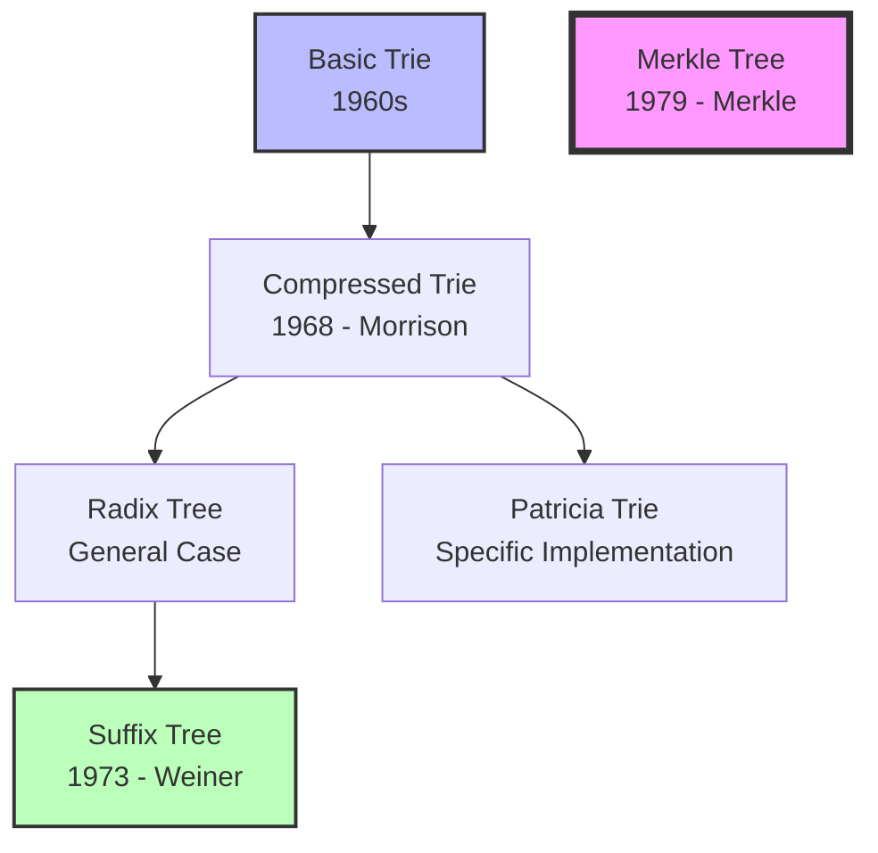
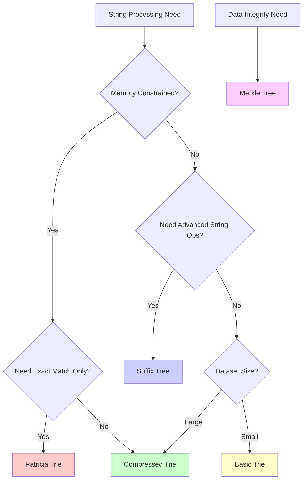

# Tree Data Structures for String Processing: A Comprehensive Guide

## Overview
This guide explores the relationships between different tree data structures used for string processing, from basic tries to advanced variants, with practical implementation guidance and performance comparisons.

## 1. The Evolution of Tree Data Structures

### 1.1 Evolutionary Timeline


### 1.2 Problem-Solution Evolution
```
Problem: String storage & retrieval
    ↓
Solution: Basic Trie
    ↓
Problem: Memory waste (many single-child nodes)
    ↓
Solution: Compressed Trie / Radix Tree
    ↓
Problem: Need for ALL substring operations
    ↓
Solution: Suffix Tree
    ↓
Separate Problem: Data integrity verification
    ↓
Solution: Merkle Tree (different domain)
```

## 2. Detailed Structure Analysis

### 2.1 Basic Trie (Prefix Tree)

#### Structure Visualization
```
Insert: ["CAT", "CAR", "CARD", "CARE"]
Tree structure:
         root
          |
          C
          |
          A
         / \
        T   R
        ●  / \
          D   E
          ●   ●
```
*● = terminal node (end of word)*

#### Characteristics Table
| Property | Value | Impact |
|----------|-------|--------|
| **Alphabet Size** | 26-256 chars | Node branching factor |
| **Tree Depth** | Length of longest string | Memory usage grows linearly |
| **Space Complexity** | O(ALPHABET_SIZE × N × M) | Can be prohibitive |
| **Time Complexity** | O(\|S\|) for operations | Excellent for queries |

#### Implementation Concept
```python
class BasicTrie:
    def __init__(self):
        self.children = {}  # char -> BasicTrie
        self.is_terminal = False
        
    def insert(self, word):
        node = self
        for char in word:
            if char not in node.children:
                node.children[char] = BasicTrie()
            node = node.children[char]
        node.is_terminal = True
```

#### Use Cases & Trade-offs
✅ **Best For:**
- Dictionary lookups
- Autocomplete systems
- Spell checkers
- Small to medium datasets

❌ **Limitations:**
- Memory inefficient for sparse data
- Deep trees for long strings
- No semantic understanding

### 2.2 Word-Level Trie (Multi-Granularity Extension)

#### Structure Visualization
```
Insert: ["machine learning", "machine vision", "data science"]
Tree structure:
         root
        /    \
   "machine"  "data"
      |         |
  "learning" "science"
      |         ●
      ●
   "vision"
      ●
```

#### Granularity Comparison Table
| Granularity | Alphabet Size | Tree Depth | Memory | Use Case |
|-------------|---------------|------------|---------|----------|
| **Character** | 26-256 | String length | High | Spell check, DNA |
| **Word** | 10K-1M | Sentence length | Medium | NLP, phrases |
| **Sentence** | Unlimited | Very shallow | Low | Templates |
| **N-gram** | Variable | Fixed | High | Language models |

#### Dynamic Granularity Strategy
```python
def choose_optimal_granularity(text, context):
    """Select granularity based on data characteristics"""
    
    if context == "dna_sequence":
        return "character"  # Fixed alphabet: ATCG
    elif context == "natural_language":
        return "word"      # Semantic units
    elif context == "structured_data":
        return "field"     # Database fields, CSV columns
    elif context == "code":
        return "token"     # Keywords, identifiers
    else:
        return "character"  # Safe fallback
```

### 2.3 Compressed Trie / Radix Tree

#### Structure Visualization - Before Compression
```
Basic Trie for ["CAR", "CARD"]:
         root
          |
          C
          |
          A
          |
          R
          ● (CAR ends here)
          |
          D
          ●
```

#### Structure Visualization - After Compression
```
Compressed Trie:
         root
          |
        "CAR"
          ● (CAR ends here)
          |
         "D"
          ●
```

#### Compression Algorithm
```python
class CompressedTrie:
    def __init__(self):
        self.edges = {}      # substring -> CompressedTrie
        self.is_terminal = False
        
    def insert(self, word):
        """Insert with automatic path compression"""
        if not word:
            self.is_terminal = True
            return
            
        # Find matching edge or create new one
        for edge_label in self.edges:
            common_prefix = self.longest_common_prefix(word, edge_label)
            
            if common_prefix == edge_label:
                # Full match - continue with remainder
                remainder = word[len(common_prefix):]
                self.edges[edge_label].insert(remainder)
                return
            elif common_prefix:
                # Partial match - split edge
                self.split_edge(edge_label, common_prefix)
                remainder = word[len(common_prefix):]
                self.edges[common_prefix].insert(remainder)
                return
        
        # No match - create new edge
        new_child = CompressedTrie()
        self.edges[word] = new_child
        new_child.is_terminal = True
```

#### Performance Improvements
| Metric | Basic Trie | Compressed Trie | Improvement |
|--------|------------|-----------------|-------------|
| **Node Count** | O(total chars) | O(number of strings) | 50-90% reduction |
| **Memory Usage** | High | Medium | 60-80% savings |
| **Query Speed** | Fast | Faster | Better cache locality |

### 2.4 Patricia Trie (Practical Algorithm to Retrieve Information)

#### Key Innovation: Skip Distances
Instead of storing full substrings, Patricia tries store:
- **Skip distance**: How many characters to skip
- **Test character**: Which character to check

#### Structure Example
```
Patricia Trie for ["HELLO", "HELP"]:
         root
          |
    [skip:2, test:'L']
         / \
   [skip:0] [skip:1]
    "HELLO"  "HELP"
        ●      ●
```

#### Implementation Concept
```python
class PatriciaNode:
    def __init__(self):
        self.skip_distance = 0
        self.test_char_index = 0
        self.children = {}
        self.is_terminal = False
        
    def search(self, word, original_strings):
        """Search requires access to original strings"""
        if self.skip_distance > 0:
            # Skip characters in original string
            current_pos += self.skip_distance
            
        if current_pos < len(word):
            test_char = word[current_pos]
            if test_char in self.children:
                return self.children[test_char].search(word, original_strings)
        
        return self.is_terminal
```

#### Trade-off Analysis
| Aspect | Patricia Trie | Regular Compressed Trie |
|--------|---------------|-------------------------|
| **Memory (edges)** | Very Low | Medium |
| **Memory (strings)** | Must keep originals | Can discard |
| **Query Speed** | Fast | Fast |
| **Implementation** | Complex | Moderate |

### 2.5 Suffix Tree

#### Purpose: Store ALL Suffixes
For string "BANANA$":
- Suffixes: "BANANA$", "ANANA$", "NANA$", "ANA$", "NA$", "A$", "$"

#### Structure Visualization
```
Suffix Tree for "BANANA$":
                root
             /  |  |  \
           "A" "B" "N" "$"
          /     |   |    ●
    "NANA$"  "ANANA$" "A"
        ●        ●     / \
                   "NA$" "$"
                     ●    ●
```

#### Advanced Applications
```python
class SuffixTreeApplications:
    def __init__(self, text):
        self.suffix_tree = self.build_suffix_tree(text)
    
    def find_pattern(self, pattern):
        """O(m) pattern matching in O(n) preprocessed text"""
        return self.traverse_pattern(pattern, self.suffix_tree.root)
    
    def longest_common_substring(self, text1, text2):
        """Find LCS using generalized suffix tree"""
        combined = text1 + "#" + text2 + "$"
        gst = self.build_generalized_suffix_tree(combined)
        return self.find_deepest_common_node(gst)
    
    def find_all_repeats(self, min_length=2):
        """Find all repeated substrings"""
        repeats = []
        self.dfs_repeats(self.suffix_tree.root, "", repeats, min_length)
        return repeats
```

#### Performance Characteristics
| Operation | Suffix Tree | Alternative |
|-----------|-------------|-------------|
| **Construction** | O(n) with Ukkonen | O(n²) naive |
| **Pattern Search** | O(m) | O(n×m) naive |
| **LCS** | O(n+m) | O(n×m) DP |
| **Memory** | O(n) | Varies |

### 2.6 Merkle Tree (Cryptographic Hash Tree)

#### Completely Different Purpose
Merkle trees solve data integrity, not string processing.

#### Structure Visualization
```
Merkle Tree for data blocks [D1, D2, D3, D4]:
                Root Hash
               /         \
        Hash(H1+H2)    Hash(H3+H4)
         /     \         /     \
      H1=H(D1) H2=H(D2) H3=H(D3) H4=H(D4)
       |        |        |        |
      D1       D2       D3       D4
```

#### Implementation Concept
```python
import hashlib

class MerkleTree:
    def __init__(self, data_blocks):
        self.data_blocks = data_blocks
        self.tree = self.build_tree()
    
    def build_tree(self):
        """Build Merkle tree from data blocks"""
        current_level = [self.hash_data(block) for block in self.data_blocks]
        
        while len(current_level) > 1:
            next_level = []
            
            for i in range(0, len(current_level), 2):
                left = current_level[i]
                right = current_level[i+1] if i+1 < len(current_level) else left
                
                combined_hash = self.hash_data(left + right)
                next_level.append(combined_hash)
            
            current_level = next_level
        
        return current_level[0]  # Root hash
    
    def verify_block(self, block_index, block_data, proof_path):
        """Verify a single block without downloading entire dataset"""
        computed_hash = self.hash_data(block_data)
        
        for sibling_hash, direction in proof_path:
            if direction == "left":
                computed_hash = self.hash_data(sibling_hash + computed_hash)
            else:
                computed_hash = self.hash_data(computed_hash + sibling_hash)
        
        return computed_hash == self.tree  # Compare with root
```

#### Applications Comparison
| Tree Type | Primary Use | Domain |
|-----------|-------------|--------|
| **Tries** | String operations | Text processing |
| **Suffix Trees** | Advanced string algorithms | Bioinformatics, search |
| **Merkle Trees** | Data integrity | Blockchain, distributed systems |

## 3. Decision Framework

### 3.1 Selection Matrix

#### For String Processing Applications


#### Performance vs. Complexity Trade-offs
| Structure | Implementation | Memory | Query Speed | Use Case Fit |
|-----------|----------------|--------|-------------|--------------|
| **Basic Trie** | Simple | High | Fast | Small datasets |
| **Word-Level Trie** | Simple | Medium | Very Fast | NLP applications |
| **Compressed Trie** | Moderate | Medium | Fast | General purpose |
| **Patricia Trie** | Complex | Low | Fast | Memory-critical |
| **Suffix Tree** | Very Complex | High | Ultra Fast | Advanced algorithms |
| **Merkle Tree** | Moderate | Low | N/A | Data verification |

### 3.2 Real-World Application Mapping

#### Text Processing Domain
```python
class TextProcessingDecisionTree:
    @staticmethod
    def recommend_structure(use_case, constraints):
        """Recommend optimal tree structure based on requirements"""
        
        if use_case == "autocomplete":
            if constraints.memory_limited:
                return "compressed_trie"
            else:
                return "basic_trie"
        
        elif use_case == "spell_checker":
            return "basic_trie"  # Simple, effective
        
        elif use_case == "dna_analysis":
            return "suffix_tree"  # Pattern matching critical
        
        elif use_case == "search_engine":
            if constraints.query_volume_high:
                return "suffix_tree"  # Preprocessing acceptable
            else:
                return "compressed_trie"
        
        elif use_case == "address_classification":
            return "word_level_trie"  # Hierarchical structure
        
        elif use_case == "blockchain":
            return "merkle_tree"  # Data integrity
        
        else:
            return "compressed_trie"  # Safe default
```

## 4. Advanced Implementation Patterns

### 4.1 Hybrid Approaches

#### Multi-Level Trie System
```python
class HybridTrieSystem:
    """Combine different granularities for optimal performance"""
    
    def __init__(self):
        # Level 1: Coarse-grained for fast filtering
        self.phrase_trie = WordLevelTrie()
        
        # Level 2: Fine-grained for exact matching
        self.char_trie = BasicTrie()
        
        # Level 3: Fuzzy matching fallback
        self.edit_distance_index = {}
    
    def search(self, query):
        """Multi-stage search with fallbacks"""
        
        # Stage 1: Fast phrase-level matching
        phrase_matches = self.phrase_trie.search_prefix(query)
        if phrase_matches:
            return phrase_matches
        
        # Stage 2: Character-level exact matching
        char_matches = self.char_trie.search(query)
        if char_matches:
            return char_matches
        
        # Stage 3: Fuzzy matching
        return self.fuzzy_search(query)
```

#### Adaptive Granularity
```python
class AdaptiveTrieSystem:
    """Dynamically adjust granularity based on data patterns"""
    
    def __init__(self):
        self.usage_stats = {}
        self.current_granularity = "word"
        
    def adapt_granularity(self, query_patterns):
        """Adjust granularity based on query patterns"""
        
        if self.avg_query_length(query_patterns) < 5:
            # Short queries -> character level better
            self.current_granularity = "character"
        elif self.semantic_queries_common(query_patterns):
            # Semantic queries -> word level better
            self.current_granularity = "word"
        else:
            # Mixed patterns -> compressed trie
            self.current_granularity = "compressed"
```

### 4.2 Performance Optimization Techniques

#### Memory Pool for Node Allocation
```python
class TrieNodePool:
    """Efficient memory management for trie nodes"""
    
    def __init__(self, initial_size=10000):
        self.free_nodes = collections.deque()
        self.allocated_nodes = set()
        
        # Pre-allocate nodes
        for _ in range(initial_size):
            self.free_nodes.append(TrieNode())
    
    def allocate_node(self):
        """Get node from pool or create new one"""
        if self.free_nodes:
            node = self.free_nodes.popleft()
            node.reset()  # Clear previous data
            self.allocated_nodes.add(id(node))
            return node
        else:
            # Pool exhausted - allocate new
            return TrieNode()
    
    def deallocate_node(self, node):
        """Return node to pool for reuse"""
        node_id = id(node)
        if node_id in self.allocated_nodes:
            self.allocated_nodes.remove(node_id)
            self.free_nodes.append(node)
```

#### Cache-Friendly Layout
```python
class CacheOptimizedTrie:
    """Optimize memory layout for better cache performance"""
    
    def __init__(self):
        # Store nodes in contiguous array for better cache locality
        self.nodes = []
        self.free_indices = []
        
    def allocate_node_index(self):
        """Allocate node index for array-based storage"""
        if self.free_indices:
            return self.free_indices.pop()
        else:
            index = len(self.nodes)
            self.nodes.append(TrieNode())
            return index
    
    def traverse_breadth_first(self):
        """Breadth-first layout improves cache performance"""
        # Arrange nodes to minimize cache misses during traversal
        pass
```

## 5. Practical Implementation Guide

### 5.1 Choosing the Right Structure

#### Quick Decision Checklist
```
□ What's your primary operation?
  - Prefix search → Basic/Compressed Trie
  - Pattern matching → Suffix Tree
  - Data verification → Merkle Tree

□ What's your memory constraint?
  - Unlimited → Basic Trie or Suffix Tree
  - Limited → Patricia Trie or Compressed Trie
  - Very limited → Patricia Trie

□ What's your data characteristics?
  - Natural language → Word-level Trie
  - DNA sequences → Character-level Trie
  - Structured data → Field-level Trie

□ What's your performance requirement?
  - Real-time → Compressed Trie with caching
  - Batch processing → Suffix Tree
  - Mixed → Hybrid approach
```

### 5.2 Implementation Best Practices

#### Error Handling and Edge Cases
```python
class RobustTrie:
    """Production-ready trie with comprehensive error handling"""
    
    def insert(self, key, value=None):
        """Insert with validation and error handling"""
        if not key:
            raise ValueError("Cannot insert empty key")
        
        if not isinstance(key, (str, list)):
            raise TypeError("Key must be string or list of tokens")
        
        try:
            node = self.root
            for token in self.tokenize(key):
                if token not in node.children:
                    node.children[token] = TrieNode()
                node = node.children[token]
            
            node.is_terminal = True
            node.value = value
            
        except MemoryError:
            self.trigger_memory_cleanup()
            raise TrieMemoryError("Insufficient memory for insertion")
    
    def tokenize(self, key):
        """Flexible tokenization based on key type"""
        if isinstance(key, str):
            if self.granularity == "character":
                return list(key)
            else:  # word level
                return key.split()
        else:
            return key  # Assume pre-tokenized
```

#### Performance Monitoring
```python
class InstrumentedTrie:
    """Trie with built-in performance monitoring"""
    
    def __init__(self):
        self.metrics = {
            'node_count': 0,
            'depth_distribution': {},
            'query_times': [],
            'memory_usage': 0
        }
    
    def search_with_metrics(self, key):
        """Search with performance tracking"""
        start_time = time.perf_counter()
        
        result = self.search(key)
        
        end_time = time.perf_counter()
        query_time = end_time - start_time
        
        self.metrics['query_times'].append(query_time)
        
        # Update depth statistics
        depth = self.get_search_depth(key)
        self.metrics['depth_distribution'][depth] = \
            self.metrics['depth_distribution'].get(depth, 0) + 1
        
        return result
    
    def get_performance_report(self):
        """Generate comprehensive performance report"""
        return {
            'avg_query_time': statistics.mean(self.metrics['query_times']),
            'p95_query_time': statistics.quantiles(self.metrics['query_times'], n=20)[18],
            'node_count': self.metrics['node_count'],
            'avg_depth': self.calculate_average_depth(),
            'memory_usage_mb': self.estimate_memory_usage() / 1024 / 1024
        }
```

## 6. Conclusion and Recommendations

### 6.1 Key Takeaways

1. **Structure Selection is Application-Driven**: No single "best" structure exists
2. **Memory vs. Speed Trade-offs**: Understand your constraints before choosing
3. **Granularity Matters**: Character vs. word vs. phrase level affects everything
4. **Hybrid Approaches Often Win**: Combine structures for optimal performance
5. **Implementation Quality Critical**: Poor implementation can negate algorithmic benefits

### 6.2 Future Directions

#### Emerging Techniques
- **Learned Index Structures**: ML-optimized data structures
- **GPU-Accelerated Tries**: Parallel processing for massive datasets
- **Approximate Structures**: Trade accuracy for speed/memory
- **Dynamic Adaptation**: Real-time structure optimization

#### Research Areas
- **Quantum String Algorithms**: Theoretical quantum speedups
- **Neuromorphic Computing**: Event-driven string processing
- **Federated Tries**: Distributed string processing systems

The landscape of tree data structures for string processing continues to evolve, with new variants and optimizations emerging to address specific application domains and performance requirements.

## References

1. Morrison, D. R. (1968). PATRICIA—Practical Algorithm to Retrieve Information Coded in Alphanumeric. *Journal of the ACM*, 15(4), 514-534.

2. Weiner, P. (1973). Linear Pattern Matching Algorithms. *Proceedings of the 14th Annual Symposium on Switching and Automata Theory*, 1-11.

3. Ukkonen, E. (1995). On-line construction of suffix trees. *Algorithmica*, 14(3), 249-260.

4. Merkle, R. C. (1987). A Digital Signature Based on a Conventional Encryption Function. *Advances in Cryptology — CRYPTO '87*, 369-378.

5. Knuth, D. E. (1973). *The Art of Computer Programming, Volume 3: Sorting and Searching*. Addison-Wesley.

6. Gusfield, D. (1997). *Algorithms on Strings, Trees, and Sequences: Computer Science and Computational Biology*. Cambridge University Press.
