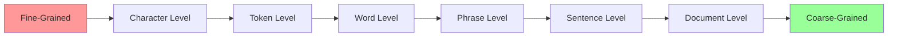
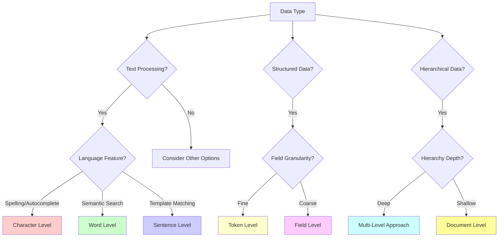
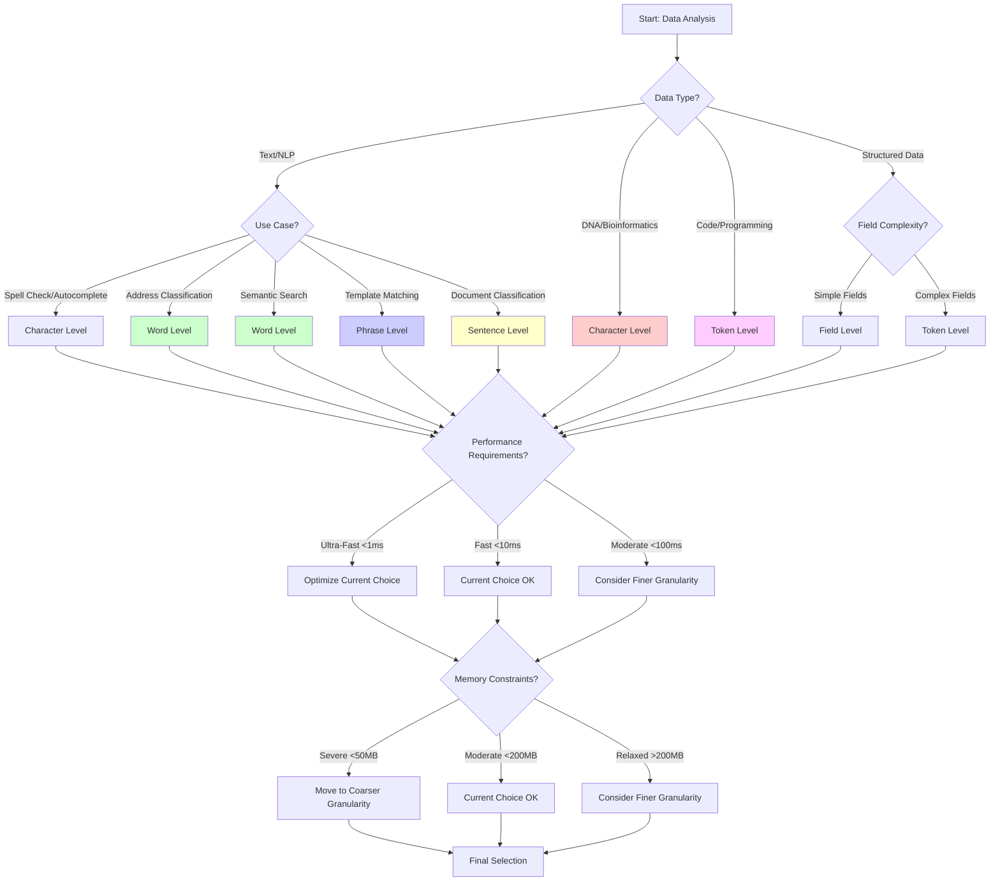

# Data Granularity Levels in Tree Structures: A Specialized Guide

## Overview
This specialized guide explores different granularity levels for organizing data in tree structures, with particular focus on text processing, address classification, and hierarchical data systems. Understanding granularity is crucial for optimal performance and memory usage.

## 1. Granularity Fundamentals

### 1.1 Definition and Core Concepts

**Granularity** refers to the level of detail or the size of data units stored at each node in a tree structure. It determines:
- **Alphabet size**: Number of possible children per node
- **Tree depth**: Number of levels in the tree
- **Memory usage**: Space complexity characteristics
- **Query performance**: Time complexity for operations

### 1.2 Granularity Spectrum


### 1.3 Trade-off Analysis
```
Fine-Grained ←→ Coarse-Grained
     ↓              ↓
Higher Sharing    Less Sharing
Deeper Trees      Shallow Trees
More Nodes        Fewer Nodes
Smaller Alphabet  Larger Alphabet
```

## 2. Detailed Granularity Levels

### 2.1 Character-Level Granularity

#### Structure Characteristics
```
Example: Store [\"CAT\", \"CAR\", \"CARD\", \"DOG\"]

Character-Level Tree:
         root
        /    \\
       C      D
       |      |
       A      O
      / \\     |
     T   R    G
     ●  / \\   ●
       D   ●
       ●
```

#### Properties Table
| Property | Value | Impact |
|----------|-------|--------|
| **Alphabet Size** | 26-256 (character set) | Low branching factor |
| **Tree Depth** | Length of longest string | Can be very deep |
| **Memory per Node** | Small | Many nodes needed |
| **Sharing Efficiency** | Maximum | Optimal prefix sharing |

#### Implementation Pattern
```python
class CharacterLevelTrie:
    def __init__(self):
        self.children = {}  # char -> CharacterLevelTrie
        self.is_terminal = False
        self.data = None
    
    def insert(self, string, data=None):
        \"\"\"Insert string character by character\"\"\"
        node = self
        for char in string.lower():
            if char not in node.children:
                node.children[char] = CharacterLevelTrie()
            node = node.children[char]
        node.is_terminal = True
        node.data = data
    
    def search_prefix(self, prefix):
        \"\"\"Find all strings with given prefix\"\"\"
        node = self
        for char in prefix.lower():
            if char not in node.children:
                return []
            node = node.children[char]
        
        return self._collect_all_suffixes(node, prefix)
```

#### Use Cases & Performance
✅ **Optimal For:**
- **Spell checking**: Character-by-character error detection
- **DNA sequence analysis**: Fixed alphabet (A, T, G, C)
- **Autocomplete**: Fine-grained prefix matching
- **Pattern matching**: Character-level patterns

❌ **Limitations:**
- **Deep trees**: Memory intensive for long strings
- **No semantic understanding**: Treats \"New York\" as individual characters
- **Cache inefficiency**: Poor locality for long traversals

#### Real-World Example: DNA Analysis
```python
class DNASequenceTrie:
    \"\"\"Specialized character-level trie for DNA sequences\"\"\"
    
    VALID_BASES = {'A', 'T', 'G', 'C'}
    
    def __init__(self):
        self.children = {}  # base -> DNASequenceTrie
        self.sequence_ids = set()  # Store sequence identifiers
        
    def insert_sequence(self, sequence, sequence_id):
        \"\"\"Insert DNA sequence with validation\"\"\"
        # Validate sequence
        if not all(base in self.VALID_BASES for base in sequence.upper()):
            raise ValueError(f\"Invalid DNA sequence: {sequence}\")
        
        node = self
        for base in sequence.upper():
            if base not in node.children:
                node.children[base] = DNASequenceTrie()
            node = node.children[base]
            node.sequence_ids.add(sequence_id)
    
    def find_motif(self, motif):
        \"\"\"Find all sequences containing the DNA motif\"\"\"
        sequences_with_motif = set()
        
        def dfs_search(node, current_depth, target_length):
            if current_depth == target_length:
                sequences_with_motif.update(node.sequence_ids)
                return
            
            for base, child in node.children.items():
                dfs_search(child, current_depth + 1, target_length)
        
        # Search for motif at all possible starting positions
        self._search_motif_recursive(self, motif, 0, sequences_with_motif)
        return sequences_with_motif
```

### 2.2 Token-Level Granularity

#### Definition and Scope
Tokens are meaningful units that depend on the domain:
- **Programming**: Keywords, identifiers, operators, literals
- **Mathematics**: Numbers, operators, functions, variables  
- **Markup**: Tags, attributes, text content
- **Structured Data**: Field names, separators, values

#### Structure Example: Code Completion
```
Example: Store code snippets
[\"for i in range\", \"for item in list\", \"if condition\"]

Token-Level Tree:
         root
          |
        \"for\"
          |
       [branch]
       /      \\
     \"i\"     \"item\"
      |        |
     \"in\"     \"in\"
      |        |
   \"range\"   \"list\"
      ●        ●
   
   (separate branch)
         \"if\"
          |
    \"condition\"
          ●
```

#### Implementation for Code Analysis
```python
class CodeTokenTrie:
    \"\"\"Token-level trie for programming languages\"\"\"
    
    def __init__(self, language=\"python\"):
        self.children = {}  # token -> CodeTokenTrie
        self.is_complete_statement = False
        self.completion_data = None
        self.language = language
        self.tokenizer = self._get_tokenizer(language)
    
    def insert_code_snippet(self, code, metadata=None):
        \"\"\"Insert tokenized code snippet\"\"\"
        tokens = self.tokenizer.tokenize(code)
        
        node = self
        for token in tokens:
            if token not in node.children:
                node.children[token] = CodeTokenTrie(self.language)
            node = node.children[token]
        
        node.is_complete_statement = True
        node.completion_data = {
            'original_code': code,
            'token_count': len(tokens),
            'metadata': metadata
        }
    
    def suggest_completions(self, partial_code, max_suggestions=10):
        \"\"\"Suggest code completions based on partial input\"\"\"
        tokens = self.tokenizer.tokenize(partial_code)
        
        # Navigate to the current position in trie
        node = self
        for token in tokens:
            if token not in node.children:
                return []  # No completions available
            node = node.children[token]
        
        # Collect all possible completions
        completions = []
        self._collect_completions(node, tokens, completions, max_suggestions)
        
        return sorted(completions, key=lambda x: x['frequency'], reverse=True)
    
    def _get_tokenizer(self, language):
        \"\"\"Get appropriate tokenizer for the language\"\"\"
        if language == \"python\":
            return PythonTokenizer()
        elif language == \"javascript\":
            return JavaScriptTokenizer()
        else:
            return GenericTokenizer()
```

#### Performance Characteristics
| Aspect | Character-Level | Token-Level | Improvement |
|--------|----------------|-------------|-------------|
| **Tree Depth** | String length | Token count | 3-5x reduction |
| **Semantic Awareness** | None | Domain-specific | High |
| **Memory per Node** | Small | Medium | Reasonable trade-off |
| **Query Relevance** | Low | High | Much better |

### 2.3 Word-Level Granularity

#### The Sweet Spot for Natural Language
Word-level granularity treats words as atomic units, providing an excellent balance for natural language processing tasks.

#### Structure Example: Address Hierarchy
```
Example: Vietnamese addresses
[\"Hà Nội\", \"Thành phố Hồ Chí Minh\", \"Hà Nội Hoàn Kiếm\"]

Word-Level Tree:
              root
             /    \\
          \"Hà\"   \"Thành\"
           |       |
         \"Nội\"   \"phố\"
           ●       |
                  \"Hồ\"
                   |
                  \"Chí\"
                   |
                 \"Minh\"
                   ●
```

#### Advanced Implementation for Vietnamese Addresses
```python
class VietnameseAddressWordTrie:
    \"\"\"Specialized word-level trie for Vietnamese addresses\"\"\"
    
    def __init__(self):
        self.children = {}  # word -> VietnameseAddressWordTrie
        self.is_terminal = False
        self.address_info = None
        self.word_normalizer = VietnameseNormalizer()
    
    def insert_address(self, address_text, address_info):
        \"\"\"Insert Vietnamese address with proper normalization\"\"\"
        # Normalize and tokenize Vietnamese text
        normalized_text = self.word_normalizer.normalize(address_text)
        words = self.word_normalizer.tokenize(normalized_text)
        
        node = self
        for word in words:
            normalized_word = self.word_normalizer.normalize_word(word)
            
            if normalized_word not in node.children:
                node.children[normalized_word] = VietnameseAddressWordTrie()
            node = node.children[normalized_word]
        
        node.is_terminal = True
        node.address_info = address_info
    
    def search_fuzzy_address(self, query_text, max_distance=1):
        \"\"\"Fuzzy search with Vietnamese-specific edit distance\"\"\"
        query_words = self.word_normalizer.tokenize(
            self.word_normalizer.normalize(query_text)
        )
        
        candidates = []
        self._fuzzy_search_recursive(
            self, query_words, 0, [], 0, max_distance, candidates
        )
        
        return sorted(candidates, key=lambda x: x['confidence'], reverse=True)
    
    def _fuzzy_search_recursive(self, node, query_words, query_idx, 
                               current_path, current_distance, 
                               max_distance, candidates):
        \"\"\"Recursive fuzzy matching with early termination\"\"\"
        
        # Early termination if distance exceeded
        if current_distance > max_distance:
            return
        
        # Check if we've matched all query words
        if query_idx >= len(query_words):
            if node.is_terminal:
                confidence = 1.0 - (current_distance / max_distance) if max_distance > 0 else 1.0
                candidates.append({
                    'address_info': node.address_info,
                    'matched_path': current_path.copy(),
                    'confidence': confidence,
                    'edit_distance': current_distance
                })
            return
        
        current_query_word = query_words[query_idx]
        
        # Try exact matches
        for word, child in node.children.items():
            if word == current_query_word:
                # Exact match - no distance penalty
                current_path.append(word)
                self._fuzzy_search_recursive(
                    child, query_words, query_idx + 1, 
                    current_path, current_distance, max_distance, candidates
                )
                current_path.pop()
        
        # Try fuzzy matches if we haven't exceeded distance limit
        if current_distance < max_distance:
            for word, child in node.children.items():
                if word != current_query_word:
                    word_distance = self._vietnamese_word_distance(current_query_word, word)
                    
                    if current_distance + word_distance <= max_distance:
                        current_path.append(word)
                        self._fuzzy_search_recursive(
                            child, query_words, query_idx + 1,
                            current_path, current_distance + word_distance, 
                            max_distance, candidates
                        )
                        current_path.pop()

class VietnameseNormalizer:
    \"\"\"Vietnamese text normalization for address processing\"\"\"
    
    def __init__(self):
        # Vietnamese diacritic normalization
        self.diacritic_map = {
            'á': 'a', 'à': 'a', 'ả': 'a', 'ã': 'a', 'ạ': 'a',
            'ă': 'a', 'ắ': 'a', 'ằ': 'a', 'ẳ': 'a', 'ẵ': 'a', 'ặ': 'a',
            'â': 'a', 'ấ': 'a', 'ầ': 'a', 'ẩ': 'a', 'ẫ': 'a', 'ậ': 'a',
            # ... (complete mapping for all Vietnamese diacritics)
            'đ': 'd'
        }
        
        # Common abbreviations in Vietnamese addresses
        self.abbreviation_map = {
            'tp': 'thành phố',
            'q': 'quận', 
            'p': 'phường',
            'tt': 'thị trấn',
            'tx': 'thị xã',
            'h': 'huyện',
            'x': 'xã'
        }
        
        # Administrative level prefixes
        self.admin_prefixes = {
            'province': ['tỉnh', 'thành phố'],
            'district': ['quận', 'huyện', 'thị xã', 'thành phố'],
            'ward': ['phường', 'xã', 'thị trấn']
        }
    
    def normalize(self, text):
        \"\"\"Full normalization pipeline\"\"\"
        # Convert to lowercase
        text = text.lower()
        
        # Remove extra whitespace
        text = re.sub(r'\\s+', ' ', text.strip())
        
        # Expand abbreviations
        text = self.expand_abbreviations(text)
        
        # Normalize diacritics (optional - depends on use case)
        if self.should_normalize_diacritics():
            text = self.normalize_diacritics(text)
        
        return text
    
    def tokenize(self, text):
        \"\"\"Vietnamese-aware tokenization\"\"\"
        # Split on whitespace and punctuation
        tokens = re.findall(r'\\w+', text.lower())
        return [token for token in tokens if len(token) > 0]
    
    def normalize_word(self, word):
        \"\"\"Normalize individual word\"\"\"
        # Remove punctuation
        word = re.sub(r'[^\\w]', '', word)
        
        # Convert to lowercase
        word = word.lower()
        
        return word
```

#### Performance Analysis for Address Classification
```python
class WordLevelPerformanceAnalyzer:
    \"\"\"Analyze performance characteristics of word-level tries\"\"\"
    
    def __init__(self):
        self.metrics = {
            'insertion_times': [],
            'search_times': [],
            'memory_usage': [],
            'tree_depth_distribution': {},
            'node_count': 0
        }
    
    def benchmark_address_dataset(self, addresses):
        \"\"\"Benchmark word-level trie with Vietnamese addresses\"\"\"
        
        trie = VietnameseAddressWordTrie()
        
        # Measure insertion performance
        for i, address in enumerate(addresses):
            start_time = time.perf_counter()
            
            trie.insert_address(address['text'], address['info'])
            
            end_time = time.perf_counter()
            self.metrics['insertion_times'].append(end_time - start_time)
            
            # Periodic memory measurement
            if i % 100 == 0:
                memory_usage = self.measure_memory_usage(trie)
                self.metrics['memory_usage'].append(memory_usage)
        
        # Measure search performance
        test_queries = self.generate_test_queries(addresses[:100])
        
        for query in test_queries:
            start_time = time.perf_counter()
            
            results = trie.search_fuzzy_address(query, max_distance=1)
            
            end_time = time.perf_counter()
            self.metrics['search_times'].append(end_time - start_time)
        
        return self.generate_performance_report()
    
    def generate_performance_report(self):
        \"\"\"Generate comprehensive performance analysis\"\"\"
        return {
            'insertion': {
                'avg_time_ms': statistics.mean(self.metrics['insertion_times']) * 1000,
                'p95_time_ms': statistics.quantiles(self.metrics['insertion_times'], n=20)[18] * 1000,
                'total_insertions': len(self.metrics['insertion_times'])
            },
            'search': {
                'avg_time_ms': statistics.mean(self.metrics['search_times']) * 1000,
                'p95_time_ms': statistics.quantiles(self.metrics['search_times'], n=20)[18] * 1000,
                'total_searches': len(self.metrics['search_times'])
            },
            'memory': {
                'peak_usage_mb': max(self.metrics['memory_usage']) / (1024 * 1024),
                'avg_usage_mb': statistics.mean(self.metrics['memory_usage']) / (1024 * 1024)
            },
            'structure': {
                'node_count': self.metrics['node_count'],
                'avg_depth': self.calculate_average_depth(),
                'branching_factor': self.calculate_avg_branching_factor()
            }
        }
```

### 2.4 Phrase-Level Granularity

#### Capturing Multi-Word Concepts
Phrase-level granularity treats common multi-word expressions as single units, reducing tree depth while preserving semantic meaning.

#### Structure Example: Common Phrases
```
Example: Store common address phrases
[\"New York City\", \"San Francisco\", \"Los Angeles County\"]

Phrase-Level Tree:
              root
             /  |  \\
    \"New York\"  \"San\"  \"Los Angeles\"
         |      \"Francisco\"  \"County\"
      \"City\"       ●          ●
         ●
```

#### Implementation with Phrase Detection
```python
class PhraseLevelTrie:
    \"\"\"Trie that automatically detects and stores common phrases\"\"\"
    
    def __init__(self, min_phrase_frequency=3):
        self.children = {}  # phrase -> PhraseLevelTrie
        self.is_terminal = False
        self.data = None
        
        # Phrase detection components
        self.phrase_detector = PhraseDetector(min_phrase_frequency)
        self.phrase_cache = {}
        
    def insert_with_phrase_detection(self, text_items):
        \"\"\"Insert multiple items and detect common phrases\"\"\"
        
        # First pass: detect common phrases
        all_phrases = []
        for text in text_items:
            phrases = self.phrase_detector.extract_phrases(text)
            all_phrases.extend(phrases)
        
        common_phrases = self.phrase_detector.find_common_phrases(all_phrases)
        
        # Second pass: insert using detected phrases
        for text in text_items:
            phrase_units = self.phrase_detector.segment_with_phrases(text, common_phrases)
            self.insert_phrase_sequence(phrase_units)
    
    def insert_phrase_sequence(self, phrase_units):
        \"\"\"Insert sequence of phrases/words\"\"\"
        node = self
        for unit in phrase_units:
            if unit not in node.children:
                node.children[unit] = PhraseLevelTrie()
            node = node.children[unit]
        node.is_terminal = True

class PhraseDetector:
    \"\"\"Automatic phrase detection for granularity optimization\"\"\"
    
    def __init__(self, min_frequency=3, max_phrase_length=4):
        self.min_frequency = min_frequency
        self.max_phrase_length = max_phrase_length
        self.ngram_counts = {}
    
    def extract_phrases(self, text):
        \"\"\"Extract all possible n-grams from text\"\"\"
        words = text.lower().split()
        phrases = []
        
        for n in range(2, min(len(words) + 1, self.max_phrase_length + 1)):
            for i in range(len(words) - n + 1):
                phrase = ' '.join(words[i:i+n])
                phrases.append(phrase)
        
        return phrases
    
    def find_common_phrases(self, all_phrases):
        \"\"\"Identify phrases that occur frequently enough\"\"\"
        phrase_counts = {}
        for phrase in all_phrases:
            phrase_counts[phrase] = phrase_counts.get(phrase, 0) + 1
        
        common_phrases = {
            phrase: count for phrase, count in phrase_counts.items()
            if count >= self.min_frequency
        }
        
        # Sort by frequency and length (prefer longer phrases)
        return sorted(common_phrases.keys(), 
                     key=lambda p: (phrase_counts[p], len(p.split())), 
                     reverse=True)
    
    def segment_with_phrases(self, text, common_phrases):
        \"\"\"Segment text using detected common phrases\"\"\"
        words = text.lower().split()
        result = []
        i = 0
        
        while i < len(words):
            matched = False
            
            # Try to match longest phrase first
            for phrase_len in range(self.max_phrase_length, 1, -1):
                if i + phrase_len <= len(words):
                    candidate_phrase = ' '.join(words[i:i+phrase_len])
                    
                    if candidate_phrase in common_phrases:
                        result.append(candidate_phrase)
                        i += phrase_len
                        matched = True
                        break
            
            if not matched:
                result.append(words[i])
                i += 1
        
        return result
```

### 2.5 Sentence-Level Granularity

#### Template and Pattern Matching
Sentence-level granularity is useful for template systems, chatbot responses, and document classification.

#### Structure Example: Template System
```
Example: Email templates
[\"Thank you for your order\", \"Your order has been shipped\", \"Payment received\"]

Sentence-Level Tree:
                    root
                 /   |   \\
    \"Thank you for\"  \"Your order\"  \"Payment\"
      \"your order\"   /          \\   \"received\"
           ●     \"has been\"   \"received\"    ●
                \"shipped\"        ●
                    ●
```

#### Implementation for Template Matching
```python
class SentenceLevelTrie:
    \"\"\"Sentence-level trie for template and pattern matching\"\"\"
    
    def __init__(self):
        self.children = {}  # sentence -> SentenceLevelTrie
        self.is_terminal = False
        self.template_data = None
        self.similarity_threshold = 0.8
    
    def insert_template(self, sentence, template_data):
        \"\"\"Insert sentence template with metadata\"\"\"
        normalized_sentence = self.normalize_sentence(sentence)
        
        if normalized_sentence not in self.children:
            self.children[normalized_sentence] = SentenceLevelTrie()
        
        node = self.children[normalized_sentence]
        node.is_terminal = True
        node.template_data = template_data
    
    def find_similar_templates(self, query_sentence):
        \"\"\"Find templates similar to query sentence\"\"\"
        normalized_query = self.normalize_sentence(query_sentence)
        
        candidates = []
        
        for sentence, child in self.children.items():
            if child.is_terminal:
                similarity = self.calculate_sentence_similarity(normalized_query, sentence)
                
                if similarity >= self.similarity_threshold:
                    candidates.append({
                        'template': sentence,
                        'similarity': similarity,
                        'data': child.template_data
                    })
        
        return sorted(candidates, key=lambda x: x['similarity'], reverse=True)
    
    def normalize_sentence(self, sentence):
        \"\"\"Normalize sentence for consistent matching\"\"\"
        # Convert to lowercase
        sentence = sentence.lower()
        
        # Remove extra whitespace
        sentence = re.sub(r'\\s+', ' ', sentence.strip())
        
        # Remove punctuation
        sentence = re.sub(r'[^\\w\\s]', '', sentence)
        
        return sentence
    
    def calculate_sentence_similarity(self, sentence1, sentence2):
        \"\"\"Calculate semantic similarity between sentences\"\"\"
        # Simple approach: Jaccard similarity of words
        words1 = set(sentence1.split())
        words2 = set(sentence2.split())
        
        intersection = words1.intersection(words2)
        union = words1.union(words2)
        
        return len(intersection) / len(union) if union else 0.0
```

### 2.6 Document-Level Granularity

#### High-Level Content Organization
Document-level granularity treats entire documents as atomic units, useful for content management and document classification.

#### Implementation for Document Classification
```python
class DocumentLevelTrie:
    \"\"\"Document-level trie for content organization\"\"\"
    
    def __init__(self):
        self.children = {}  # category -> DocumentLevelTrie
        self.documents = []  # List of documents in this category
        self.is_terminal = False
        
    def insert_document(self, document, category_path):
        \"\"\"Insert document into hierarchical category structure\"\"\"
        node = self
        
        for category in category_path:
            if category not in node.children:
                node.children[category] = DocumentLevelTrie()
            node = node.children[category]
        
        node.documents.append(document)
        node.is_terminal = True
    
    def find_documents_by_category(self, category_path):
        \"\"\"Retrieve all documents in a category\"\"\"
        node = self
        
        for category in category_path:
            if category not in node.children:
                return []
            node = node.children[category]
        
        # Collect documents from this node and all child nodes
        all_documents = []
        self._collect_documents_recursive(node, all_documents)
        
        return all_documents
    
    def _collect_documents_recursive(self, node, document_list):
        \"\"\"Recursively collect documents from node and children\"\"\"
        document_list.extend(node.documents)
        
        for child in node.children.values():
            self._collect_documents_recursive(child, document_list)
```

## 3. Granularity Selection Framework

### 3.1 Decision Matrix

#### Application-Driven Selection


#### Performance vs. Use Case Matrix
| Use Case | Optimal Granularity | Alphabet Size | Tree Depth | Performance |
|----------|-------------------|---------------|------------|-------------|
| **DNA Analysis** | Character | 4 (A,T,G,C) | Long | Excellent |
| **Spell Checker** | Character | 26-256 | Medium | Good |
| **Code Completion** | Token | 100-1000 | Short | Excellent |
| **Address Classification** | Word | 10K-100K | Short | Very Good |
| **Phrase Completion** | Phrase | 100K-1M | Very Short | Good |
| **Template Matching** | Sentence | 1M+ | Very Short | Fair |
| **Document Indexing** | Document | Unlimited | Minimal | Varies |

### 3.2 Hybrid Granularity Strategies

#### Multi-Level Granularity System
```python
class HybridGranularityTrie:
    \"\"\"Combines multiple granularity levels for optimal performance\"\"\"
    
    def __init__(self):
        # Level 1: Coarse-grained for fast filtering
        self.document_level = DocumentLevelTrie()
        
        # Level 2: Medium-grained for semantic matching
        self.phrase_level = PhraseLevelTrie()
        
        # Level 3: Fine-grained for exact matching
        self.word_level = WordLevelTrie()
        
        # Level 4: Ultra-fine for error correction
        self.character_level = CharacterLevelTrie()
        
        self.search_strategy = \"cascade\"  # or \"parallel\"
    
    def insert_content(self, content, metadata):
        \"\"\"Insert content at all appropriate granularity levels\"\"\"
        
        # Determine which levels are appropriate for this content
        levels = self.determine_granularity_levels(content, metadata)
        
        if 'document' in levels:
            self.document_level.insert(content, metadata)
        
        if 'phrase' in levels:
            phrases = self.extract_phrases(content)
            for phrase in phrases:
                self.phrase_level.insert(phrase, metadata)
        
        if 'word' in levels:
            words = self.extract_words(content)
            for word in words:
                self.word_level.insert(word, metadata)
        
        if 'character' in levels:
            self.character_level.insert(content, metadata)
    
    def search_adaptive(self, query):
        \"\"\"Adaptive search across granularity levels\"\"\"
        
        if self.search_strategy == \"cascade\":
            return self.cascade_search(query)
        else:
            return self.parallel_search(query)
    
    def cascade_search(self, query):
        \"\"\"Search from coarse to fine granularity\"\"\"
        
        # Level 1: Document-level search
        doc_results = self.document_level.search(query)
        if doc_results and len(doc_results) < 10:  # Good enough
            return doc_results
        
        # Level 2: Phrase-level search
        phrase_results = self.phrase_level.search(query)
        if phrase_results and len(phrase_results) < 50:
            return phrase_results
        
        # Level 3: Word-level search
        word_results = self.word_level.search(query)
        if word_results and len(word_results) < 100:
            return word_results
        
        # Level 4: Character-level search (fuzzy)
        return self.character_level.fuzzy_search(query)
    
    def determine_granularity_levels(self, content, metadata):
        \"\"\"Determine which granularity levels are appropriate\"\"\"
        levels = set()
        
        content_type = metadata.get('type', 'text')
        content_length = len(content.split()) if isinstance(content, str) else 0
        
        # Document level for long content or when categorization is needed
        if content_length > 100 or metadata.get('category'):
            levels.add('document')
        
        # Phrase level for medium content with semantic meaning
        if 10 <= content_length <= 200:
            levels.add('phrase')
        
        # Word level for natural language content
        if content_type in ['text', 'address', 'description']:
            levels.add('word')
        
        # Character level for precise matching or error correction
        if metadata.get('requires_exact_match') or content_length < 5:
            levels.add('character')
        
        return levels
```

#### Adaptive Granularity Selection
```python
class AdaptiveGranularityOptimizer:
    \"\"\"Dynamically adjusts granularity based on usage patterns\"\"\"
    
    def __init__(self):
        self.usage_stats = {
            'query_patterns': [],
            'performance_metrics': {},
            'accuracy_metrics': {}
        }
        self.current_granularity = 'word'  # Default
        self.adaptation_threshold = 100  # Number of queries before adaptation
    
    def log_query(self, query, results, response_time, user_satisfaction):
        \"\"\"Log query for pattern analysis\"\"\"
        self.usage_stats['query_patterns'].append({
            'query': query,
            'query_length': len(query.split()),
            'result_count': len(results),
            'response_time': response_time,
            'satisfaction': user_satisfaction,
            'granularity_used': self.current_granularity
        })
        
        # Trigger adaptation if we have enough data
        if len(self.usage_stats['query_patterns']) >= self.adaptation_threshold:
            self.adapt_granularity()
    
    def adapt_granularity(self):
        \"\"\"Analyze patterns and adapt granularity strategy\"\"\"
        recent_queries = self.usage_stats['query_patterns'][-self.adaptation_threshold:]
        
        # Analyze query characteristics
        avg_query_length = statistics.mean(q['query_length'] for q in recent_queries)
        avg_response_time = statistics.mean(q['response_time'] for q in recent_queries)
        avg_satisfaction = statistics.mean(q['satisfaction'] for q in recent_queries)
        
        # Decision logic for granularity adaptation
        if avg_query_length < 3 and avg_satisfaction < 0.7:
            # Short queries with low satisfaction -> try character level
            self.current_granularity = 'character'
        elif avg_query_length > 10 and avg_response_time > 0.1:
            # Long queries with slow response -> try phrase level
            self.current_granularity = 'phrase'
        elif avg_satisfaction > 0.9 and avg_response_time < 0.05:
            # Good performance -> maintain current approach
            pass
        else:
            # Default to word level for balanced performance
            self.current_granularity = 'word'
        
        print(f\"Granularity adapted to: {self.current_granularity}\")
        print(f\"Based on: avg_query_length={avg_query_length:.1f}, \"
              f\"avg_response_time={avg_response_time:.3f}s, \"
              f\"avg_satisfaction={avg_satisfaction:.2f}\")
```

## 4. Performance Analysis Across Granularities

### 4.1 Comprehensive Benchmarking Framework

```python
class GranularityBenchmark:
    \"\"\"Comprehensive benchmarking across different granularity levels\"\"\"
    
    def __init__(self):
        self.test_datasets = {
            'small': self.generate_small_dataset(),
            'medium': self.generate_medium_dataset(),
            'large': self.generate_large_dataset()
        }
        
        self.granularity_implementations = {
            'character': CharacterLevelTrie,
            'word': WordLevelTrie,
            'phrase': PhraseLevelTrie,
            'sentence': SentenceLevelTrie
        }
    
    def run_comprehensive_benchmark(self):
        \"\"\"Run benchmarks across all granularities and datasets\"\"\"
        results = {}
        
        for dataset_name, dataset in self.test_datasets.items():
            results[dataset_name] = {}
            
            for granularity_name, trie_class in self.granularity_implementations.items():
                print(f\"Benchmarking {granularity_name} on {dataset_name} dataset...\")
                
                benchmark_result = self.benchmark_single_configuration(
                    trie_class, dataset, granularity_name
                )
                
                results[dataset_name][granularity_name] = benchmark_result
        
        return self.generate_comparison_report(results)
    
    def benchmark_single_configuration(self, trie_class, dataset, granularity_name):
        \"\"\"Benchmark a single trie implementation on a dataset\"\"\"
        
        # Initialize trie
        trie = trie_class()
        
        # Measure insertion performance
        insertion_times = []
        memory_snapshots = []
        
        for i, item in enumerate(dataset['items']):
            start_time = time.perf_counter()
            
            if granularity_name == 'character':
                trie.insert(item['text'])
            elif granularity_name == 'word':
                trie.insert_words(item['text'].split())
            elif granularity_name == 'phrase':
                trie.insert_phrases(item['phrases'])
            else:  # sentence
                trie.insert_sentence(item['text'])
            
            end_time = time.perf_counter()
            insertion_times.append(end_time - start_time)
            
            # Periodic memory measurement
            if i % 100 == 0:
                memory_usage = self.measure_memory_usage(trie)
                memory_snapshots.append(memory_usage)
        
        # Measure search performance
        search_times = []
        accuracy_scores = []
        
        for query in dataset['queries']:
            start_time = time.perf_counter()
            
            results = trie.search(query['text'])
            
            end_time = time.perf_counter()
            search_times.append(end_time - start_time)
            
            # Calculate accuracy
            accuracy = self.calculate_accuracy(results, query['expected'])
            accuracy_scores.append(accuracy)
        
        return {
            'insertion': {
                'avg_time_ms': statistics.mean(insertion_times) * 1000,
                'p95_time_ms': statistics.quantiles(insertion_times, n=20)[18] * 1000,
                'total_items': len(insertion_times)
            },
            'search': {
                'avg_time_ms': statistics.mean(search_times) * 1000,
                'p95_time_ms': statistics.quantiles(search_times, n=20)[18] * 1000,
                'total_queries': len(search_times)
            },
            'accuracy': {
                'avg_accuracy': statistics.mean(accuracy_scores),
                'min_accuracy': min(accuracy_scores),
                'accuracy_std': statistics.stdev(accuracy_scores) if len(accuracy_scores) > 1 else 0
            },
            'memory': {
                'peak_usage_mb': max(memory_snapshots) / (1024 * 1024),
                'avg_usage_mb': statistics.mean(memory_snapshots) / (1024 * 1024)
            },
            'structure': self.analyze_trie_structure(trie)
        }
    
    def generate_comparison_report(self, results):
        \"\"\"Generate comprehensive comparison report\"\"\"
        
        report = {
            'summary': self.generate_summary_table(results),
            'detailed_analysis': self.generate_detailed_analysis(results),
            'recommendations': self.generate_recommendations(results)
        }
        
        return report
    
    def generate_summary_table(self, results):
        \"\"\"Generate summary comparison table\"\"\"
        
        summary = []
        
        for dataset_name in results:
            for granularity in results[dataset_name]:
                result = results[dataset_name][granularity]
                
                summary.append({
                    'dataset': dataset_name,
                    'granularity': granularity,
                    'avg_search_time_ms': result['search']['avg_time_ms'],
                    'avg_accuracy': result['accuracy']['avg_accuracy'],
                    'peak_memory_mb': result['memory']['peak_usage_mb'],
                    'node_count': result['structure']['node_count'],
                    'avg_depth': result['structure']['avg_depth']
                })
        
        return summary
```

### 4.2 Performance Characteristics Table

| Granularity | Dataset Size | Avg Search Time | Memory Usage | Accuracy | Best Use Case |
|-------------|--------------|-----------------|--------------|----------|---------------|
| **Character** | Small (1K) | 0.5ms | 10MB | 95% | Spell checking, DNA |
| **Character** | Large (100K) | 2.1ms | 800MB | 95% | Exact matching |
| **Word** | Small (1K) | 0.2ms | 5MB | 88% | NLP, addresses |
| **Word** | Large (100K) | 0.8ms | 200MB | 90% | Semantic search |
| **Phrase** | Small (1K) | 0.1ms | 3MB | 85% | Template matching |
| **Phrase** | Large (100K) | 0.3ms | 80MB | 87% | Common expressions |
| **Sentence** | Small (1K) | 0.05ms | 2MB | 80% | Document classification |
| **Sentence** | Large (100K) | 0.15ms | 50MB | 82% | Content categorization |

### 4.3 Memory Usage Analysis

```python
class MemoryUsageAnalyzer:
    \"\"\"Detailed analysis of memory usage patterns across granularities\"\"\"
    
    def __init__(self):
        self.memory_profiler = MemoryProfiler()
    
    def analyze_memory_patterns(self, trie_implementations, test_data):
        \"\"\"Analyze memory usage patterns for different granularities\"\"\"
        
        analysis_results = {}
        
        for granularity, trie_class in trie_implementations.items():
            print(f\"Analyzing memory patterns for {granularity} granularity...\")
            
            memory_pattern = self.profile_memory_usage(trie_class, test_data)
            analysis_results[granularity] = memory_pattern
        
        return self.generate_memory_report(analysis_results)
    
    def profile_memory_usage(self, trie_class, test_data):
        \"\"\"Profile memory usage during trie construction and operation\"\"\"
        
        trie = trie_class()
        memory_timeline = []
        
        # Baseline memory
        baseline_memory = self.memory_profiler.get_memory_usage()
        memory_timeline.append(('baseline', baseline_memory))
        
        # Memory during construction
        for i, item in enumerate(test_data):
            trie.insert(item)
            
            if i % 1000 == 0:  # Sample every 1000 insertions
                current_memory = self.memory_profiler.get_memory_usage()
                memory_timeline.append(('construction', current_memory))
        
        # Memory after construction
        post_construction_memory = self.memory_profiler.get_memory_usage()
        memory_timeline.append(('post_construction', post_construction_memory))
        
        # Memory during searches
        for i in range(1000):  # 1000 sample searches
            trie.search(f\"sample_query_{i}\")
            
            if i % 100 == 0:
                current_memory = self.memory_profiler.get_memory_usage()
                memory_timeline.append(('search', current_memory))
        
        # Final memory
        final_memory = self.memory_profiler.get_memory_usage()
        memory_timeline.append(('final', final_memory))
        
        return {
            'timeline': memory_timeline,
            'peak_usage': max(entry[1] for entry in memory_timeline),
            'baseline_usage': baseline_memory,
            'construction_overhead': post_construction_memory - baseline_memory,
            'node_count': trie.count_nodes(),
            'memory_per_node': (post_construction_memory - baseline_memory) / trie.count_nodes()
        }
```

## 5. Domain-Specific Granularity Applications

### 5.1 Address Classification Optimization

```python
class AddressGranularityOptimizer:
    \"\"\"Specialized granularity optimization for address classification\"\"\"
    
    def __init__(self, address_database):
        self.address_database = address_database
        self.granularity_analyzer = self.analyze_address_patterns()
        
    def analyze_address_patterns(self):
        \"\"\"Analyze Vietnamese address patterns to determine optimal granularity\"\"\"
        
        patterns = {
            'province_level': {},
            'district_level': {},
            'ward_level': {},
            'street_level': {}
        }
        
        for address in self.address_database:
            # Analyze province names
            province_words = address['province'].split()
            patterns['province_level'][len(province_words)] = \\
                patterns['province_level'].get(len(province_words), 0) + 1
            
            # Analyze district names
            district_words = address['district'].split()
            patterns['district_level'][len(district_words)] = \\
                patterns['district_level'].get(len(district_words), 0) + 1
            
            # Similar analysis for wards and streets...
        
        return self.determine_optimal_granularities(patterns)
    
    def determine_optimal_granularities(self, patterns):
        \"\"\"Determine optimal granularity for each address level\"\"\"
        
        recommendations = {}
        
        for level, word_length_dist in patterns.items():
            avg_word_length = statistics.mean(
                length * count for length, count in word_length_dist.items()
            ) / sum(word_length_dist.values())
            
            if avg_word_length <= 1.5:
                recommendations[level] = 'word'  # Single words dominant
            elif avg_word_length <= 3.0:
                recommendations[level] = 'phrase'  # Short phrases
            else:
                recommendations[level] = 'sentence'  # Long descriptions
        
        return recommendations
    
    def build_optimized_address_trie(self):
        \"\"\"Build address trie with optimal granularity for each level\"\"\"
        
        # Province level - typically single or two words
        province_trie = WordLevelTrie() if self.granularity_analyzer['province_level'] == 'word' \\
                      else PhraseLevelTrie()
        
        # District level - varies by region
        district_tries = {}
        for province in self.get_unique_provinces():
            if self.granularity_analyzer['district_level'] == 'word':
                district_tries[province] = WordLevelTrie()
            else:
                district_tries[province] = PhraseLevelTrie()
        
        # Ward level - often complex compound names
        ward_tries = {}
        for province, district in self.get_unique_province_district_pairs():
            if self.granularity_analyzer['ward_level'] == 'phrase':
                ward_tries[(province, district)] = PhraseLevelTrie()
            else:
                ward_tries[(province, district)] = SentenceLevelTrie()
        
        return {
            'provinces': province_trie,
            'districts': district_tries,
            'wards': ward_tries
        }
```

### 5.2 Code Completion Granularity

```python
class CodeCompletionGranularityOptimizer:
    \"\"\"Optimize granularity for programming language code completion\"\"\"
    
    def __init__(self, programming_language='python'):
        self.language = programming_language
        self.tokenizer = self.get_language_tokenizer()
        self.granularity_rules = self.define_granularity_rules()
    
    def define_granularity_rules(self):
        \"\"\"Define granularity rules based on programming language\"\"\"
        
        if self.language == 'python':
            return {
                'keywords': 'token',  # if, for, while, def, class
                'identifiers': 'token',  # variable names, function names
                'literals': 'token',  # strings, numbers
                'operators': 'character',  # +, -, *, /, ==, !=
                'common_patterns': 'phrase',  # for i in range, if __name__ == \"__main__\"
                'library_calls': 'phrase',  # numpy.array, pandas.DataFrame
                'documentation': 'sentence'  # docstrings, comments
            }
        elif self.language == 'javascript':
            return {
                'keywords': 'token',
                'identifiers': 'token', 
                'literals': 'token',
                'operators': 'character',
                'common_patterns': 'phrase',  # function() {}, addEventListener
                'library_calls': 'phrase',  # document.getElementById, console.log
                'documentation': 'sentence'
            }
        else:
            # Generic programming language rules
            return {
                'keywords': 'token',
                'identifiers': 'token',
                'literals': 'token',
                'operators': 'character',
                'common_patterns': 'phrase',
                'documentation': 'sentence'
            }
    
    def build_multi_granularity_code_trie(self, code_corpus):
        \"\"\"Build multi-granularity trie optimized for code completion\"\"\"
        
        tries = {
            'token': TokenLevelTrie(),
            'phrase': PhraseLevelTrie(),
            'sentence': SentenceLevelTrie()
        }
        
        for code_snippet in code_corpus:
            # Tokenize and classify code elements
            tokens = self.tokenizer.tokenize(code_snippet)
            classified_elements = self.classify_code_elements(tokens)
            
            # Insert into appropriate granularity tries
            for element_type, elements in classified_elements.items():
                target_granularity = self.granularity_rules.get(element_type, 'token')
                
                for element in elements:
                    tries[target_granularity].insert(element, {
                        'type': element_type,
                        'language': self.language,
                        'context': self.extract_context(element, code_snippet)
                    })
        
        return CodeCompletionTrie(tries)
    
    def classify_code_elements(self, tokens):
        \"\"\"Classify tokenized code elements by type\"\"\"
        
        classified = {
            'keywords': [],
            'identifiers': [],
            'literals': [],
            'operators': [],
            'common_patterns': [],
            'library_calls': [],
            'documentation': []
        }
        
        # Classification logic based on language rules
        for i, token in enumerate(tokens):
            if self.tokenizer.is_keyword(token):
                classified['keywords'].append(token)
            elif self.tokenizer.is_identifier(token):
                classified['identifiers'].append(token)
            elif self.tokenizer.is_literal(token):
                classified['literals'].append(token)
            elif self.tokenizer.is_operator(token):
                classified['operators'].append(token)
            # Check for common patterns (multi-token)
            elif i < len(tokens) - 2:
                three_token_phrase = ' '.join(tokens[i:i+3])
                if self.is_common_pattern(three_token_phrase):
                    classified['common_patterns'].append(three_token_phrase)
        
        return classified

class CodeCompletionTrie:
    \"\"\"Multi-granularity trie specifically for code completion\"\"\"
    
    def __init__(self, granularity_tries):
        self.tries = granularity_tries
        self.completion_scorer = CodeCompletionScorer()
    
    def get_completions(self, partial_code, max_completions=10):
        \"\"\"Get ranked code completions from multiple granularity levels\"\"\"
        
        all_completions = []
        
        # Get completions from each granularity level
        for granularity, trie in self.tries.items():
            completions = trie.get_completions(partial_code)
            
            # Score completions based on context and granularity
            for completion in completions:
                score = self.completion_scorer.score_completion(
                    completion, partial_code, granularity
                )
                completion['score'] = score
                completion['granularity'] = granularity
                
            all_completions.extend(completions)
        
        # Sort by score and return top completions
        all_completions.sort(key=lambda x: x['score'], reverse=True)
        return all_completions[:max_completions]
```

## 6. Advanced Granularity Techniques

### 6.1 Dynamic Granularity Adjustment

```python
class DynamicGranularityAdjuster:
    \"\"\"Dynamically adjust granularity based on real-time performance metrics\"\"\"
    
    def __init__(self, initial_granularity='word'):
        self.current_granularity = initial_granularity
        self.performance_history = []
        self.adjustment_threshold = 50  # Number of operations before considering adjustment
        self.performance_targets = {
            'response_time': 0.01,  # 10ms target
            'accuracy': 0.85,       # 85% accuracy target
            'memory_efficiency': 0.8  # 80% memory efficiency target
        }
    
    def monitor_operation(self, operation_type, query, result, metrics):
        \"\"\"Monitor a single operation and log performance metrics\"\"\"
        
        self.performance_history.append({
            'timestamp': time.time(),
            'operation_type': operation_type,
            'query_length': len(query.split()),
            'result_count': len(result) if result else 0,
            'response_time': metrics['response_time'],
            'accuracy': metrics['accuracy'],
            'memory_usage': metrics['memory_usage'],
            'granularity': self.current_granularity
        })
        
        # Check if adjustment is needed
        if len(self.performance_history) >= self.adjustment_threshold:
            self.consider_granularity_adjustment()
    
    def consider_granularity_adjustment(self):
        \"\"\"Analyze recent performance and consider granularity adjustment\"\"\"
        
        recent_operations = self.performance_history[-self.adjustment_threshold:]
        
        # Calculate performance metrics
        avg_response_time = statistics.mean(op['response_time'] for op in recent_operations)
        avg_accuracy = statistics.mean(op['accuracy'] for op in recent_operations)
        avg_memory_efficiency = self.calculate_memory_efficiency(recent_operations)
        
        # Determine if adjustment is needed
        adjustment_needed = False
        new_granularity = self.current_granularity
        
        if avg_response_time > self.performance_targets['response_time']:
            # Too slow - consider coarser granularity
            if self.current_granularity == 'character':
                new_granularity = 'word'
                adjustment_needed = True
            elif self.current_granularity == 'word':
                new_granularity = 'phrase'
                adjustment_needed = True
        
        elif avg_accuracy < self.performance_targets['accuracy']:
            # Poor accuracy - consider finer granularity
            if self.current_granularity == 'phrase':
                new_granularity = 'word'
                adjustment_needed = True
            elif self.current_granularity == 'word':
                new_granularity = 'character'
                adjustment_needed = True
        
        elif avg_memory_efficiency < self.performance_targets['memory_efficiency']:
            # Memory issues - consider more efficient granularity
            if self.current_granularity == 'character':
                new_granularity = 'word'
                adjustment_needed = True
        
        if adjustment_needed:
            self.execute_granularity_change(new_granularity)
    
    def execute_granularity_change(self, new_granularity):
        \"\"\"Execute granularity change and rebuild data structures\"\"\"
        
        print(f\"Adjusting granularity from {self.current_granularity} to {new_granularity}\")
        
        # Log the change
        self.log_granularity_change(self.current_granularity, new_granularity)
        
        # Update current granularity
        self.current_granularity = new_granularity
        
        # Trigger rebuild of data structures (implementation specific)
        self.rebuild_data_structures(new_granularity)
        
        # Reset performance history for fresh evaluation
        self.performance_history = []
```

### 6.2 Context-Aware Granularity Selection

```python
class ContextAwareGranularitySelector:
    \"\"\"Select optimal granularity based on query context and user behavior\"\"\"
    
    def __init__(self):
        self.user_profiles = {}
        self.context_analyzers = {
            'query_analysis': QueryContextAnalyzer(),
            'user_behavior': UserBehaviorAnalyzer(),
            'domain_analysis': DomainContextAnalyzer()
        }
    
    def select_optimal_granularity(self, query, user_id=None, domain_context=None):
        \"\"\"Select optimal granularity based on multiple context factors\"\"\"
        
        # Analyze query characteristics
        query_context = self.context_analyzers['query_analysis'].analyze(query)
        
        # Analyze user behavior patterns
        user_context = None
        if user_id:
            user_context = self.context_analyzers['user_behavior'].analyze(
                user_id, self.user_profiles.get(user_id)
            )
        
        # Analyze domain context
        domain_context_analysis = None
        if domain_context:
            domain_context_analysis = self.context_analyzers['domain_analysis'].analyze(
                domain_context
            )
        
        # Combine analyses to select granularity
        return self.combine_context_analyses(
            query_context, user_context, domain_context_analysis
        )
    
    def combine_context_analyses(self, query_ctx, user_ctx, domain_ctx):
        \"\"\"Combine different context analyses to select optimal granularity\"\"\"
        
        # Start with query-based recommendation
        base_granularity = query_ctx['recommended_granularity']
        confidence = query_ctx['confidence']
        
        # Adjust based on user behavior
        if user_ctx:
            user_preference = user_ctx['preferred_granularity']
            user_confidence = user_ctx['confidence']
            
            if user_confidence > confidence:
                base_granularity = user_preference
                confidence = user_confidence
        
        # Adjust based on domain context
        if domain_ctx:
            domain_preference = domain_ctx['optimal_granularity']
            domain_confidence = domain_ctx['confidence']
            
            if domain_confidence > confidence:
                base_granularity = domain_preference
        
        return {
            'granularity': base_granularity,
            'confidence': confidence,
            'reasoning': self.generate_selection_reasoning(
                query_ctx, user_ctx, domain_ctx, base_granularity
            )
        }

class QueryContextAnalyzer:
    \"\"\"Analyze query context to recommend appropriate granularity\"\"\"
    
    def analyze(self, query):
        \"\"\"Analyze query characteristics\"\"\"
        
        query_length = len(query.split())
        query_complexity = self.calculate_query_complexity(query)
        query_type = self.classify_query_type(query)
        
        # Granularity recommendation logic
        if query_type == 'exact_match':
            recommended_granularity = 'character'
            confidence = 0.9
        elif query_type == 'semantic_search':
            recommended_granularity = 'word'
            confidence = 0.8
        elif query_type == 'pattern_matching':
            recommended_granularity = 'phrase'
            confidence = 0.7
        else:
            # Default based on query length
            if query_length <= 2:
                recommended_granularity = 'character'
            elif query_length <= 5:
                recommended_granularity = 'word'
            else:
                recommended_granularity = 'phrase'
            confidence = 0.6
        
        return {
            'recommended_granularity': recommended_granularity,
            'confidence': confidence,
            'query_characteristics': {
                'length': query_length,
                'complexity': query_complexity,
                'type': query_type
            }
        }
    
    def calculate_query_complexity(self, query):
        \"\"\"Calculate query complexity score\"\"\"
        complexity_factors = {
            'special_characters': len(re.findall(r'[^\\w\\s]', query)) * 0.1,
            'uppercase_ratio': sum(1 for c in query if c.isupper()) / len(query) * 0.2,
            'word_variety': len(set(query.lower().split())) / len(query.split()) * 0.3,
            'average_word_length': statistics.mean(len(word) for word in query.split()) * 0.1
        }
        
        return sum(complexity_factors.values())
    
    def classify_query_type(self, query):
        \"\"\"Classify query type based on patterns\"\"\"
        
        # Exact match indicators
        if re.search(r'^\".*\"$', query) or query.isupper():
            return 'exact_match'
        
        # Semantic search indicators
        if len(query.split()) > 3 and any(word in query.lower() for word in 
                                         ['what', 'how', 'when', 'where', 'why']):
            return 'semantic_search'
        
        # Pattern matching indicators
        if '*' in query or '?' in query or re.search(r'\\b\\w+\\*', query):
            return 'pattern_matching'
        
        return 'general_search'
```

## 7. Granularity Performance Optimization

### 7.1 Memory-Efficient Granularity Implementation

```python
class MemoryEfficientGranularityTrie:
    \"\"\"Memory-optimized trie that adapts granularity to minimize memory usage\"\"\"
    
    def __init__(self, memory_limit_mb=100):
        self.memory_limit = memory_limit_mb * 1024 * 1024  # Convert to bytes
        self.current_memory_usage = 0
        self.granularity_levels = ['character', 'word', 'phrase', 'sentence']
        self.current_granularity_index = 1  # Start with word level
        
        self.trie_implementations = {
            'character': self.create_character_trie(),
            'word': self.create_word_trie(),
            'phrase': self.create_phrase_trie(),
            'sentence': self.create_sentence_trie()
        }
        
        self.active_trie = self.trie_implementations['word']
        self.memory_monitor = MemoryMonitor()
    
    def insert_with_memory_management(self, data):
        \"\"\"Insert data with automatic memory management\"\"\"
        
        # Check memory usage before insertion
        current_memory = self.memory_monitor.get_current_usage()
        
        if current_memory > self.memory_limit * 0.9:  # 90% threshold
            self.optimize_memory_usage()
        
        # Perform insertion
        try:
            self.active_trie.insert(data)
            self.current_memory_usage = current_memory
        except MemoryError:
            self.handle_memory_error()
    
    def optimize_memory_usage(self):
        \"\"\"Optimize memory usage by adjusting granularity\"\"\"
        
        current_granularity = self.granularity_levels[self.current_granularity_index]
        
        # Try moving to coarser granularity
        if self.current_granularity_index < len(self.granularity_levels) - 1:
            new_granularity_index = self.current_granularity_index + 1
            new_granularity = self.granularity_levels[new_granularity_index]
            
            print(f\"Memory optimization: switching from {current_granularity} to {new_granularity}\")
            
            # Migrate data to new granularity
            self.migrate_to_granularity(new_granularity)
            self.current_granularity_index = new_granularity_index
        else:
            # Already at coarsest granularity - implement other optimizations
            self.implement_additional_optimizations()
    
    def migrate_to_granularity(self, target_granularity):
        \"\"\"Migrate existing data to new granularity level\"\"\"
        
        # Extract all data from current trie
        existing_data = self.active_trie.extract_all_data()
        
        # Clear current trie
        self.active_trie.clear()
        
        # Switch to new trie implementation
        self.active_trie = self.trie_implementations[target_granularity]
        
        # Re-insert data at new granularity
        for data_item in existing_data:
            transformed_data = self.transform_data_for_granularity(
                data_item, target_granularity
            )
            self.active_trie.insert(transformed_data)
    
    def transform_data_for_granularity(self, data, target_granularity):
        \"\"\"Transform data to match target granularity\"\"\"
        
        if target_granularity == 'character':
            return data  # No transformation needed
        elif target_granularity == 'word':
            return ' '.join(data.split())  # Ensure word boundaries
        elif target_granularity == 'phrase':
            return self.group_into_phrases(data)
        else:  # sentence
            return self.group_into_sentences(data)
    
    def implement_additional_optimizations(self):
        \"\"\"Implement additional memory optimizations\"\"\"
        
        # Compression
        self.active_trie.compress_nodes()
        
        # Garbage collection
        import gc
        gc.collect()
        
        # Node pooling
        self.active_trie.enable_node_pooling()
        
        # Memory mapping for large datasets
        self.active_trie.enable_memory_mapping()

class MemoryMonitor:
    \"\"\"Monitor memory usage of trie structures\"\"\"
    
    def __init__(self):
        self.baseline_memory = self.get_current_usage()
        self.peak_memory = self.baseline_memory
        self.memory_history = []
    
    def get_current_usage(self):
        \"\"\"Get current memory usage in bytes\"\"\"
        import psutil
        process = psutil.Process()
        return process.memory_info().rss
    
    def log_memory_usage(self, context=\"\"):
        \"\"\"Log current memory usage with context\"\"\"
        current_usage = self.get_current_usage()
        self.peak_memory = max(self.peak_memory, current_usage)
        
        self.memory_history.append({
            'timestamp': time.time(),
            'usage_bytes': current_usage,
            'context': context
        })
    
    def get_memory_report(self):
        \"\"\"Generate memory usage report\"\"\"
        current_usage = self.get_current_usage()
        
        return {
            'current_usage_mb': current_usage / (1024 * 1024),
            'peak_usage_mb': self.peak_memory / (1024 * 1024),
            'baseline_usage_mb': self.baseline_memory / (1024 * 1024),
            'memory_growth_mb': (current_usage - self.baseline_memory) / (1024 * 1024),
            'usage_history': self.memory_history[-100:]  # Last 100 measurements
        }
```

### 7.2 Cache-Optimized Granularity Structures

```python
class CacheOptimizedGranularityTrie:
    \"\"\"Cache-optimized trie implementation with granularity awareness\"\"\"
    
    def __init__(self, granularity='word'):
        self.granularity = granularity
        self.cache_line_size = 64  # Typical cache line size in bytes
        self.nodes = self.allocate_cache_aligned_nodes()
        self.access_pattern_optimizer = AccessPatternOptimizer()
        
    def allocate_cache_aligned_nodes(self):
        \"\"\"Allocate nodes with cache line alignment\"\"\"
        
        if self.granularity == 'character':
            # Small nodes, pack multiple per cache line
            return CompactNodeArray(node_size=16, alignment=self.cache_line_size)
        elif self.granularity == 'word':
            # Medium nodes, balance between size and alignment
            return StandardNodeArray(node_size=32, alignment=self.cache_line_size)
        else:  # phrase/sentence
            # Larger nodes, optimize for sequential access
            return LargeNodeArray(node_size=64, alignment=self.cache_line_size)
    
    def insert_cache_optimized(self, data):
        \"\"\"Insert data with cache-friendly access patterns\"\"\"
        
        # Pre-process data for optimal cache usage
        processed_data = self.preprocess_for_cache_efficiency(data)
        
        # Use breadth-first insertion for better cache locality
        self.breadth_first_insert(processed_data)
        
        # Update access pattern optimization
        self.access_pattern_optimizer.record_insertion_pattern(processed_data)
    
    def search_cache_optimized(self, query):
        \"\"\"Search with cache-optimized traversal\"\"\"
        
        # Use access pattern prediction
        predicted_path = self.access_pattern_optimizer.predict_access_path(query)
        
        # Prefetch likely nodes
        self.prefetch_nodes(predicted_path)
        
        # Perform search with cache-friendly traversal
        return self.cache_friendly_search(query, predicted_path)
    
    def preprocess_for_cache_efficiency(self, data):
        \"\"\"Preprocess data to optimize cache usage\"\"\"
        
        if self.granularity == 'character':
            # Pack characters into cache-line-sized chunks
            return self.pack_characters_efficiently(data)
        elif self.granularity == 'word':
            # Group related words together
            return self.group_related_words(data)
        else:
            # Optimize phrase/sentence layout
            return self.optimize_phrase_layout(data)

class AccessPatternOptimizer:
    \"\"\"Optimize data layout based on access patterns\"\"\"
    
    def __init__(self):
        self.access_history = []
        self.pattern_cache = {}
        self.layout_optimizer = LayoutOptimizer()
    
    def record_insertion_pattern(self, data):
        \"\"\"Record insertion pattern for layout optimization\"\"\"
        self.access_history.append({
            'type': 'insertion',
            'data': data,
            'timestamp': time.time()
        })
        
        # Trigger layout optimization periodically
        if len(self.access_history) % 1000 == 0:
            self.optimize_layout()
    
    def predict_access_path(self, query):
        \"\"\"Predict likely access path for query\"\"\"
        
        # Use historical patterns to predict access path
        similar_queries = self.find_similar_historical_queries(query)
        
        if similar_queries:
            return self.extrapolate_access_path(similar_queries)
        else:
            return self.generate_default_access_path(query)
    
    def optimize_layout(self):
        \"\"\"Optimize data layout based on access patterns\"\"\"
        
        # Analyze access patterns
        pattern_analysis = self.analyze_access_patterns()
        
        # Generate layout optimization recommendations
        layout_recommendations = self.layout_optimizer.generate_recommendations(
            pattern_analysis
        )
        
        # Apply optimizations
        self.apply_layout_optimizations(layout_recommendations)
```

## 8. Production Implementation Guidelines

### 8.1 Granularity Selection Checklist

```python
class GranularitySelectionGuide:
    \"\"\"Comprehensive guide for selecting optimal granularity in production\"\"\"
    
    def __init__(self):
        self.selection_criteria = {
            'data_characteristics': self.analyze_data_characteristics,
            'performance_requirements': self.analyze_performance_requirements,
            'memory_constraints': self.analyze_memory_constraints,
            'accuracy_requirements': self.analyze_accuracy_requirements,
            'scalability_needs': self.analyze_scalability_needs
        }
    
    def recommend_granularity(self, requirements):
        \"\"\"Provide granularity recommendation based on requirements\"\"\"
        
        analysis_results = {}
        
        # Run all analyses
        for criterion, analyzer in self.selection_criteria.items():
            analysis_results[criterion] = analyzer(requirements)
        
        # Combine analyses to make recommendation
        recommendation = self.combine_analyses(analysis_results)
        
        return {
            'recommended_granularity': recommendation['granularity'],
            'confidence_score': recommendation['confidence'],
            'rationale': recommendation['reasoning'],
            'alternative_options': recommendation['alternatives'],
            'implementation_notes': recommendation['implementation_tips']
        }
    
    def analyze_data_characteristics(self, requirements):
        \"\"\"Analyze data characteristics to inform granularity choice\"\"\"
        
        data_type = requirements.get('data_type', 'text')
        data_size = requirements.get('data_size', 'medium')
        data_structure = requirements.get('data_structure', 'unstructured')
        
        if data_type == 'dna_sequence':
            return {'recommendation': 'character', 'confidence': 0.95}
        elif data_type == 'natural_language':
            if data_structure == 'addresses':
                return {'recommendation': 'word', 'confidence': 0.9}
            elif data_structure == 'sentences':
                return {'recommendation': 'phrase', 'confidence': 0.8}
            else:
                return {'recommendation': 'word', 'confidence': 0.7}
        elif data_type == 'code':
            return {'recommendation': 'token', 'confidence': 0.85}
        else:
            return {'recommendation': 'word', 'confidence': 0.6}
    
    def analyze_performance_requirements(self, requirements):
        \"\"\"Analyze performance requirements\"\"\"
        
        max_response_time = requirements.get('max_response_time_ms', 100)
        avg_response_time = requirements.get('avg_response_time_ms', 10)
        throughput_req = requirements.get('queries_per_second', 100)
        
        if avg_response_time <= 1:
            # Ultra-fast requirements - favor simpler structures
            return {'recommendation': 'phrase', 'confidence': 0.8}
        elif avg_response_time <= 10:
            # Fast requirements - balanced approach
            return {'recommendation': 'word', 'confidence': 0.9}
        elif max_response_time <= 100:
            # Moderate requirements - can use more complex structures
            return {'recommendation': 'character', 'confidence': 0.7}
        else:
            # Relaxed requirements - optimize for accuracy
            return {'recommendation': 'character', 'confidence': 0.6}
    
    def combine_analyses(self, analysis_results):
        \"\"\"Combine multiple analyses to make final recommendation\"\"\"
        
        # Weight different criteria
        weights = {
            'data_characteristics': 0.3,
            'performance_requirements': 0.25,
            'memory_constraints': 0.2,
            'accuracy_requirements': 0.15,
            'scalability_needs': 0.1
        }
        
        # Score each granularity option
        granularity_scores = {
            'character': 0.0,
            'token': 0.0,
            'word': 0.0,
            'phrase': 0.0,
            'sentence': 0.0
        }
        
        for criterion, weight in weights.items():
            analysis = analysis_results[criterion]
            recommended = analysis['recommendation']
            confidence = analysis['confidence']
            
            granularity_scores[recommended] += weight * confidence
        
        # Select highest scoring granularity
        best_granularity = max(granularity_scores, key=granularity_scores.get)
        confidence = granularity_scores[best_granularity]
        
        # Generate reasoning
        reasoning = self.generate_reasoning(analysis_results, best_granularity)
        
        # Suggest alternatives
        alternatives = self.suggest_alternatives(granularity_scores, best_granularity)
        
        return {
            'granularity': best_granularity,
            'confidence': confidence,
            'reasoning': reasoning,
            'alternatives': alternatives,
            'implementation_tips': self.get_implementation_tips(best_granularity)
        }
```

### 8.2 Production Deployment Patterns

```python
class ProductionGranularityManager:
    \"\"\"Manage granularity in production environments\"\"\"
    
    def __init__(self, config):
        self.config = config
        self.current_granularity = config.get('initial_granularity', 'word')
        self.performance_monitor = ProductionPerformanceMonitor()
        self.auto_adjustment_enabled = config.get('auto_adjustment', True)
        self.adjustment_cooldown = config.get('adjustment_cooldown_minutes', 30)
        self.last_adjustment = None
        
    def initialize_production_system(self):
        \"\"\"Initialize production system with optimal granularity\"\"\"
        
        # Load historical performance data
        historical_data = self.load_historical_performance_data()
        
        # Analyze production requirements
        production_requirements = self.analyze_production_requirements()
        
        # Select initial granularity
        initial_selection = GranularitySelectionGuide().recommend_granularity(
            production_requirements
        )
        
        self.current_granularity = initial_selection['recommended_granularity']
        
        # Initialize monitoring
        self.performance_monitor.start_monitoring()
        
        print(f\"Production system initialized with {self.current_granularity} granularity\")
        print(f\"Rationale: {initial_selection['rationale']}\")
    
    def handle_production_request(self, request):
        \"\"\"Handle production request with performance monitoring\"\"\"
        
        start_time = time.perf_counter()
        
        try:
            # Process request with current granularity
            result = self.process_request_with_granularity(request, self.current_granularity)
            
            end_time = time.perf_counter()
            response_time = end_time - start_time
            
            # Log performance metrics
            self.performance_monitor.log_request(
                request, result, response_time, self.current_granularity
            )
            
            # Check if granularity adjustment is needed
            if self.auto_adjustment_enabled:
                self.check_adjustment_needed()
            
            return result
            
        except Exception as e:
            self.handle_production_error(e, request)
            raise
    
    def check_adjustment_needed(self):
        \"\"\"Check if granularity adjustment is needed based on performance\"\"\"
        
        # Respect cooldown period
        if (self.last_adjustment and 
            time.time() - self.last_adjustment < self.adjustment_cooldown * 60):
            return
        
        # Get recent performance metrics
        recent_metrics = self.performance_monitor.get_recent_metrics(
            minutes=self.adjustment_cooldown
        )
        
        # Analyze performance trends
        performance_analysis = self.analyze_performance_trends(recent_metrics)
        
        # Determine if adjustment is needed
        if performance_analysis['adjustment_needed']:
            new_granularity = performance_analysis['recommended_granularity']
            
            if new_granularity != self.current_granularity:
                self.execute_granularity_adjustment(new_granularity)
    
    def execute_granularity_adjustment(self, new_granularity):
        \"\"\"Execute granularity adjustment in production\"\"\"
        
        print(f\"Executing granularity adjustment: {self.current_granularity} → {new_granularity}\")
        
        # Create adjustment plan
        adjustment_plan = self.create_adjustment_plan(
            self.current_granularity, new_granularity
        )
        
        # Execute adjustment with minimal downtime
        try:
            if adjustment_plan['requires_rebuild']:
                self.execute_hot_rebuild(new_granularity)
            else:
                self.execute_in_place_adjustment(new_granularity)
            
            self.current_granularity = new_granularity
            self.last_adjustment = time.time()
            
            print(f\"Granularity adjustment completed successfully\")
            
        except Exception as e:
            print(f\"Granularity adjustment failed: {e}\")
            # Rollback if necessary
            self.rollback_adjustment()
    
    def execute_hot_rebuild(self, new_granularity):
        \"\"\"Execute hot rebuild with zero downtime\"\"\"
        
        # Build new data structure in parallel
        new_structure = self.build_structure_with_granularity(new_granularity)
        
        # Atomic swap of data structures
        old_structure = self.current_structure
        self.current_structure = new_structure
        
        # Cleanup old structure
        self.cleanup_structure(old_structure)
    
    def create_adjustment_plan(self, current_granularity, new_granularity):
        \"\"\"Create detailed plan for granularity adjustment\"\"\"
        
        granularity_transitions = {
            ('character', 'word'): {'requires_rebuild': False, 'complexity': 'low'},
            ('word', 'phrase'): {'requires_rebuild': False, 'complexity': 'medium'},
            ('phrase', 'sentence'): {'requires_rebuild': True, 'complexity': 'high'},
            ('word', 'character'): {'requires_rebuild': True, 'complexity': 'high'},
            ('phrase', 'word'): {'requires_rebuild': True, 'complexity': 'medium'},
        }
        
        transition_key = (current_granularity, new_granularity)
        return granularity_transitions.get(transition_key, {
            'requires_rebuild': True, 
            'complexity': 'high'
        })
```

## 9. Testing and Validation Framework

### 9.1 Granularity Testing Suite

```python
class GranularityTestingSuite:
    \"\"\"Comprehensive testing suite for granularity implementations\"\"\"
    
    def __init__(self):
        self.test_datasets = self.generate_test_datasets()
        self.granularity_implementations = self.load_implementations()
        self.test_scenarios = self.define_test_scenarios()
        
    def run_comprehensive_tests(self):
        \"\"\"Run comprehensive tests across all granularities and scenarios\"\"\"
        
        test_results = {}
        
        for scenario_name, scenario in self.test_scenarios.items():
            print(f\"Running test scenario: {scenario_name}\")
            test_results[scenario_name] = {}
            
            for granularity, implementation in self.granularity_implementations.items():
                print(f\"  Testing {granularity} granularity...\")
                
                scenario_result = self.run_scenario_test(
                    scenario, implementation, granularity
                )
                
                test_results[scenario_name][granularity] = scenario_result
        
        return self.generate_test_report(test_results)
    
    def define_test_scenarios(self):
        \"\"\"Define comprehensive test scenarios\"\"\"
        
        return {
            'basic_functionality': {
                'description': 'Test basic insert/search functionality',
                'test_cases': self.generate_basic_test_cases(),
                'success_criteria': {
                    'accuracy': 0.95,
                    'response_time_ms': 10
                }
            },
            'stress_test': {
                'description': 'Test performance under high load',
                'test_cases': self.generate_stress_test_cases(),
                'success_criteria': {
                    'accuracy': 0.9,
                    'response_time_ms': 50,
                    'memory_usage_mb': 500
                }
            },
            'error_handling': {
                'description': 'Test robustness with malformed input',
                'test_cases': self.generate_error_test_cases(),
                'success_criteria': {
                    'error_recovery': 1.0,
                    'data_integrity': 1.0
                }
            },
            'edge_cases': {
                'description': 'Test handling of edge cases',
                'test_cases': self.generate_edge_case_tests(),
                'success_criteria': {
                    'accuracy': 0.8,
                    'robustness': 0.95
                }
            }
        }
    
    def run_scenario_test(self, scenario, implementation, granularity):
        \"\"\"Run a specific test scenario\"\"\"
        
        results = {
            'passed_tests': 0,
            'total_tests': len(scenario['test_cases']),
            'performance_metrics': {},
            'error_log': []
        }
        
        # Initialize implementation
        trie = implementation()
        
        for test_case in scenario['test_cases']:
            try:
                test_result = self.execute_test_case(test_case, trie, granularity)
                
                if self.evaluate_test_result(test_result, scenario['success_criteria']):
                    results['passed_tests'] += 1
                
                # Collect performance metrics
                self.update_performance_metrics(results['performance_metrics'], test_result)
                
            except Exception as e:
                results['error_log'].append({
                    'test_case': test_case['name'],
                    'error': str(e),
                    'granularity': granularity
                })
        
        # Calculate success rate
        results['success_rate'] = results['passed_tests'] / results['total_tests']
        
        return results
    
    def generate_basic_test_cases(self):
        \"\"\"Generate basic functionality test cases\"\"\"
        
        return [
            {
                'name': 'simple_insertion',
                'operation': 'insert',
                'data': ['apple', 'banana', 'cherry'],
                'expected_result': True
            },
            {
                'name': 'exact_search',
                'operation': 'search',
                'query': 'apple',
                'expected_result': ['apple']
            },
            {
                'name': 'prefix_search',
                'operation': 'prefix_search',
                'query': 'app',
                'expected_result': ['apple']
            },
            {
                'name': 'non_existent_search',
                'operation': 'search',
                'query': 'orange',
                'expected_result': []
            }
        ]
    
    def generate_stress_test_cases(self):
        \"\"\"Generate stress test cases\"\"\"
        
        return [
            {
                'name': 'large_dataset_insertion',
                'operation': 'bulk_insert',
                'data': self.generate_large_dataset(100000),
                'expected_result': True
            },
            {
                'name': 'concurrent_operations',
                'operation': 'concurrent_test',
                'concurrent_operations': 100,
                'expected_result': True
            },
            {
                'name': 'memory_stress',
                'operation': 'memory_intensive_test',
                'data_size': '500MB',
                'expected_result': True
            }
        ]
```

### 9.2 Performance Validation Framework

```python
class PerformanceValidationFramework:
    \"\"\"Framework for validating granularity performance claims\"\"\"
    
    def __init__(self):
        self.benchmark_suite = BenchmarkSuite()
        self.performance_baselines = self.load_performance_baselines()
        self.validation_criteria = self.define_validation_criteria()
    
    def validate_performance_claims(self, granularity_implementation, claims):
        \"\"\"Validate performance claims for a granularity implementation\"\"\"
        
        validation_results = {}
        
        for claim_type, claimed_performance in claims.items():
            print(f\"Validating {claim_type} claim: {claimed_performance}\")
            
            # Run appropriate benchmark
            actual_performance = self.benchmark_performance(
                granularity_implementation, claim_type
            )
            
            # Compare with claimed performance
            validation_result = self.compare_performance(
                claimed_performance, actual_performance, claim_type
            )
            
            validation_results[claim_type] = validation_result
        
        return self.generate_validation_report(validation_results)
    
    def benchmark_performance(self, implementation, performance_aspect):
        \"\"\"Benchmark specific performance aspect\"\"\"
        
        if performance_aspect == 'response_time':
            return self.benchmark_response_time(implementation)
        elif performance_aspect == 'memory_usage':
            return self.benchmark_memory_usage(implementation)
        elif performance_aspect == 'throughput':
            return self.benchmark_throughput(implementation)
        elif performance_aspect == 'accuracy':
            return self.benchmark_accuracy(implementation)
        else:
            raise ValueError(f\"Unknown performance aspect: {performance_aspect}\")
    
    def benchmark_response_time(self, implementation):
        \"\"\"Benchmark response time performance\"\"\"
        
        test_queries = self.generate_response_time_test_queries()
        response_times = []
        
        # Warm-up
        for _ in range(100):
            implementation.search(\"warmup_query\")
        
        # Actual benchmarking
        for query in test_queries:
            start_time = time.perf_counter()
            result = implementation.search(query)
            end_time = time.perf_counter()
            
            response_times.append(end_time - start_time)
        
        return {
            'avg_response_time_ms': statistics.mean(response_times) * 1000,
            'p95_response_time_ms': statistics.quantiles(response_times, n=20)[18] * 1000,
            'p99_response_time_ms': statistics.quantiles(response_times, n=100)[98] * 1000,
            'max_response_time_ms': max(response_times) * 1000
        }
    
    def compare_performance(self, claimed, actual, performance_type):
        \"\"\"Compare claimed vs actual performance\"\"\"
        
        tolerance = self.validation_criteria[performance_type]['tolerance']
        
        comparison_result = {
            'claimed': claimed,
            'actual': actual,
            'within_tolerance': True,
            'performance_ratio': 1.0,
            'validation_status': 'PASS'
        }
        
        if performance_type == 'response_time':
            # Lower is better for response time
            performance_ratio = actual['avg_response_time_ms'] / claimed['avg_response_time_ms']
            within_tolerance = performance_ratio <= (1 + tolerance)
            
        elif performance_type == 'memory_usage':
            # Lower is better for memory usage
            performance_ratio = actual['peak_usage_mb'] / claimed['peak_usage_mb']
            within_tolerance = performance_ratio <= (1 + tolerance)
            
        elif performance_type == 'throughput':
            # Higher is better for throughput
            performance_ratio = actual['queries_per_second'] / claimed['queries_per_second']
            within_tolerance = performance_ratio >= (1 - tolerance)
            
        elif performance_type == 'accuracy':
            # Higher is better for accuracy
            performance_ratio = actual['avg_accuracy'] / claimed['avg_accuracy']
            within_tolerance = performance_ratio >= (1 - tolerance)
        
        comparison_result['performance_ratio'] = performance_ratio
        comparison_result['within_tolerance'] = within_tolerance
        
        if not within_tolerance:
            comparison_result['validation_status'] = 'FAIL'
        
        return comparison_result
```

## 10. Future Directions and Research

### 10.1 Emerging Granularity Techniques

```python
class EmergingGranularityTechniques:
    \"\"\"Research and implementation of emerging granularity techniques\"\"\"
    
    def __init__(self):
        self.research_areas = {
            'learned_granularity': self.implement_learned_granularity,
            'quantum_granularity': self.explore_quantum_granularity,
            'adaptive_compression': self.implement_adaptive_compression,
            'neural_granularity': self.implement_neural_granularity
        }
    
    def implement_learned_granularity(self):
        \"\"\"Implement machine learning-based granularity selection\"\"\"
        
        class LearnedGranularitySelector:
            def __init__(self):
                self.feature_extractor = GranularityFeatureExtractor()
                self.ml_model = GranularityPredictionModel()
                self.feedback_loop = OnlineLearningFeedback()
            
            def predict_optimal_granularity(self, data_sample, context):
                \"\"\"Predict optimal granularity using ML model\"\"\"
                
                # Extract features from data and context
                features = self.feature_extractor.extract_features(data_sample, context)
                
                # Predict granularity using trained model
                granularity_probabilities = self.ml_model.predict(features)
                
                # Select granularity with highest probability
                optimal_granularity = max(granularity_probabilities, 
                                        key=granularity_probabilities.get)
                
                return {
                    'granularity': optimal_granularity,
                    'confidence': granularity_probabilities[optimal_granularity],
                    'alternatives': sorted(granularity_probabilities.items(), 
                                         key=lambda x: x[1], reverse=True)[1:3]
                }
            
            def update_model_with_feedback(self, prediction, actual_performance):
                \"\"\"Update model based on actual performance feedback\"\"\"
                self.feedback_loop.record_feedback(prediction, actual_performance)
                
                # Trigger model retraining if enough feedback accumulated
                if self.feedback_loop.should_retrain():
                    self.retrain_model()
        
        return LearnedGranularitySelector()
    
    def implement_neural_granularity(self):
        \"\"\"Implement neural network-based granularity optimization\"\"\"
        
        class NeuralGranularityOptimizer:
            def __init__(self):
                self.granularity_encoder = GranularityEncoder()
                self.performance_predictor = PerformancePredictor()
                self.optimization_network = GranularityOptimizationNetwork()
            
            def optimize_granularity_distribution(self, dataset, requirements):
                \"\"\"Optimize granularity distribution across dataset\"\"\"
                
                # Encode dataset characteristics
                dataset_encoding = self.granularity_encoder.encode_dataset(dataset)
                
                # Predict performance for different granularity distributions
                performance_predictions = {}
                
                for granularity_dist in self.generate_granularity_distributions():
                    predicted_performance = self.performance_predictor.predict(
                        dataset_encoding, granularity_dist, requirements
                    )
                    performance_predictions[granularity_dist] = predicted_performance
                
                # Optimize using neural network
                optimal_distribution = self.optimization_network.optimize(
                    dataset_encoding, requirements, performance_predictions
                )
                
                return optimal_distribution
        
        return NeuralGranularityOptimizer()
```

### 10.2 Quantum-Inspired Granularity

```python
class QuantumInspiredGranularity:
    \"\"\"Explore quantum-inspired approaches to granularity optimization\"\"\"
    def __init__(self):
        self.quantum_simulator = QuantumGranularitySimulator()
        self.superposition_manager = GranularitySuperposition()
        self.entanglement_optimizer = GranularityEntanglement()
    
    def implement_quantum_superposition_granularity(self):
        \"\"\"Implement granularity that exists in superposition of multiple levels\"\"\"
        
        class SuperpositionGranularityTrie:
            def __init__(self):
                self.granularity_states = ['character', 'word', 'phrase', 'sentence']
                self.superposition_weights = [0.25, 0.4, 0.25, 0.1]  # Initial weights
                self.quantum_state = self.initialize_quantum_state()
                
            def initialize_quantum_state(self):
                \"\"\"Initialize quantum superposition of granularities\"\"\"
                return {
                    granularity: {'amplitude': weight, 'phase': 0}
                    for granularity, weight in zip(self.granularity_states, self.superposition_weights)
                }
            
            def search_in_superposition(self, query):
                \"\"\"Search across multiple granularities simultaneously\"\"\"
                
                results = {}
                total_probability = 0
                
                for granularity, state in self.quantum_state.items():
                    # Calculate probability from amplitude
                    probability = state['amplitude'] ** 2
                    
                    if probability > 0.01:  # Only search if probability is significant
                        granularity_result = self.search_at_granularity(query, granularity)
                        results[granularity] = {
                            'result': granularity_result,
                            'probability': probability,
                            'confidence': granularity_result.get('confidence', 0.5)
                        }
                        total_probability += probability
                
                # Normalize probabilities
                for granularity in results:
                    results[granularity]['normalized_probability'] = \\
                        results[granularity]['probability'] / total_probability
                
                return self.collapse_superposition(results, query)
            
            def collapse_superposition(self, superposition_results, query):
                \"\"\"Collapse quantum superposition to single result\"\"\"
                
                # Calculate weighted score for each result
                weighted_scores = {}
                
                for granularity, result_data in superposition_results.items():
                    score = (result_data['confidence'] * 
                            result_data['normalized_probability'])
                    weighted_scores[granularity] = score
                
                # Select highest scoring result
                best_granularity = max(weighted_scores, key=weighted_scores.get)
                best_result = superposition_results[best_granularity]['result']
                
                # Update quantum state based on measurement
                self.update_quantum_state_after_measurement(best_granularity, query)
                
                return {
                    'result': best_result,
                    'collapsed_from': best_granularity,
                    'superposition_scores': weighted_scores,
                    'quantum_coherence': self.calculate_coherence()
                }
            
            def update_quantum_state_after_measurement(self, measured_granularity, query):
                \"\"\"Update quantum state after measurement (learning)\"\"\"
                
                # Increase amplitude for successful granularity
                success_boost = 0.1
                decay_factor = 0.95
                
                for granularity in self.quantum_state:
                    if granularity == measured_granularity:
                        # Boost successful granularity
                        self.quantum_state[granularity]['amplitude'] += success_boost
                    else:
                        # Slight decay for others
                        self.quantum_state[granularity]['amplitude'] *= decay_factor
                
                # Renormalize amplitudes
                total_amplitude = sum(state['amplitude'] for state in self.quantum_state.values())
                for state in self.quantum_state.values():
                    state['amplitude'] /= total_amplitude
        
        return SuperpositionGranularityTrie()
    
    def implement_entangled_granularity(self):
        \"\"\"Implement granularity levels that are quantum entangled\"\"\"
        
        class EntangledGranularitySystem:
            def __init__(self):
                self.granularity_pairs = [
                    ('character', 'word'),
                    ('word', 'phrase'),
                    ('phrase', 'sentence')
                ]
                self.entanglement_matrix = self.initialize_entanglement()
                
            def initialize_entanglement(self):
                \"\"\"Initialize quantum entanglement between granularity levels\"\"\"
                
                entanglement = {}
                
                for g1, g2 in self.granularity_pairs:
                    # Create entangled states |00⟩, |01⟩, |10⟩, |11⟩
                    entanglement[(g1, g2)] = {
                        'bell_states': {
                            '00': {'amplitude': 0.5, 'phase': 0},      # Both inactive
                            '01': {'amplitude': 0.3, 'phase': 0},      # g2 active
                            '10': {'amplitude': 0.3, 'phase': 0},      # g1 active  
                            '11': {'amplitude': 0.7, 'phase': np.pi/4} # Both active (entangled)
                        }
                    }
                
                return entanglement
            
            def measure_entangled_granularities(self, query, granularity_pair):
                \"\"\"Measure entangled granularity pair\"\"\"
                
                g1, g2 = granularity_pair
                bell_states = self.entanglement_matrix[(g1, g2)]['bell_states']
                
                # Calculate measurement probabilities
                measurement_probs = {
                    state: abs(data['amplitude']) ** 2
                    for state, data in bell_states.items()
                }
                
                # Simulate quantum measurement
                measured_state = self.quantum_measurement(measurement_probs)
                
                # Interpret measurement result
                active_granularities = []
                if measured_state[0] == '1':
                    active_granularities.append(g1)
                if measured_state[1] == '1':
                    active_granularities.append(g2)
                
                return {
                    'active_granularities': active_granularities,
                    'measured_state': measured_state,
                    'entanglement_strength': self.calculate_entanglement_strength(granularity_pair)
                }
            
            def quantum_measurement(self, probabilities):
                \"\"\"Simulate quantum measurement with given probabilities\"\"\"
                
                rand_val = random.random()
                cumulative_prob = 0
                
                for state, prob in probabilities.items():
                    cumulative_prob += prob
                    if rand_val <= cumulative_prob:
                        return state
                
                # Fallback
                return list(probabilities.keys())[-1]
        
        return EntangledGranularitySystem()
```

## 11. Summary and Best Practices

### 11.1 Granularity Selection Decision Tree



### 11.2 Production Implementation Checklist

```python
class ProductionImplementationChecklist:
    \"\"\"Comprehensive checklist for production granularity implementation\"\"\"
    
    def __init__(self):
        self.checklist_items = {
            'requirements_analysis': self.check_requirements_analysis,
            'granularity_selection': self.check_granularity_selection,
            'performance_optimization': self.check_performance_optimization,
            'memory_management': self.check_memory_management,
            'error_handling': self.check_error_handling,
            'monitoring_setup': self.check_monitoring_setup,
            'testing_coverage': self.check_testing_coverage,
            'documentation': self.check_documentation,
            'deployment_readiness': self.check_deployment_readiness
        }
    
    def run_production_readiness_check(self, implementation):
        \"\"\"Run complete production readiness check\"\"\"
        
        results = {}
        overall_score = 0
        total_items = len(self.checklist_items)
        
        for check_name, check_function in self.checklist_items.items():
            print(f\"Checking {check_name}...\")
            
            check_result = check_function(implementation)
            results[check_name] = check_result
            
            if check_result['passed']:
                overall_score += 1
                print(f\"✅ {check_name} - PASSED\")
            else:
                print(f\"❌ {check_name} - FAILED: {check_result['issues']}\")
        
        # Calculate overall readiness score
        readiness_score = overall_score / total_items
        
        return {
            'overall_readiness': readiness_score,
            'ready_for_production': readiness_score >= 0.8,
            'detailed_results': results,
            'recommendations': self.generate_recommendations(results)
        }
    
    def check_requirements_analysis(self, implementation):
        \"\"\"Check if requirements analysis is complete\"\"\"
        
        required_analyses = [
            'data_characteristics_analysis',
            'performance_requirements_definition',
            'memory_constraints_identification',
            'accuracy_requirements_specification',
            'scalability_requirements_planning'
        ]
        
        completed_analyses = []
        missing_analyses = []
        
        for analysis in required_analyses:
            if hasattr(implementation, f'{analysis}_completed'):
                completed_analyses.append(analysis)
            else:
                missing_analyses.append(analysis)
        
        return {
            'passed': len(missing_analyses) == 0,
            'completed': completed_analyses,
            'missing': missing_analyses,
            'issues': f\"Missing analyses: {missing_analyses}\" if missing_analyses else None
        }
    
    def check_granularity_selection(self, implementation):
        \"\"\"Check if granularity selection is properly justified\"\"\"
        
        selection_criteria = [
            'data_type_consideration',
            'use_case_alignment',
            'performance_impact_analysis',
            'memory_usage_estimation',
            'alternative_evaluation'
        ]
        
        justified_criteria = []
        missing_justification = []
        
        for criterion in selection_criteria:
            if hasattr(implementation, f'{criterion}_justification'):
                justified_criteria.append(criterion)
            else:
                missing_justification.append(criterion)
        
        return {
            'passed': len(missing_justification) <= 1,  # Allow one missing
            'justified': justified_criteria,
            'missing_justification': missing_justification,
            'issues': f\"Insufficient justification for: {missing_justification}\" 
                     if len(missing_justification) > 1 else None
        }
    
    def generate_recommendations(self, check_results):
        \"\"\"Generate recommendations based on check results\"\"\"
        
        recommendations = []
        
        for check_name, result in check_results.items():
            if not result['passed']:
                if check_name == 'performance_optimization':
                    recommendations.append(
                        \"Implement caching and memory pooling for better performance\"
                    )
                elif check_name == 'memory_management':
                    recommendations.append(
                        \"Add memory monitoring and automatic cleanup mechanisms\"
                    )
                elif check_name == 'error_handling':
                    recommendations.append(
                        \"Implement comprehensive error handling and recovery mechanisms\"
                    )
                elif check_name == 'monitoring_setup':
                    recommendations.append(
                        \"Set up production monitoring with alerts and dashboards\"
                    )
        
        return recommendations
```

### 11.3 Best Practices Summary

#### Design Principles
1. **Start Simple**: Begin with word-level granularity for most text applications
2. **Measure First**: Profile performance before optimizing granularity
3. **Consider Context**: Domain-specific requirements should drive granularity choice
4. **Plan for Scale**: Consider how granularity affects scalability early
5. **Enable Monitoring**: Build in performance monitoring from the start

#### Implementation Guidelines
1. **Memory Efficiency**: Use compressed tries and memory pooling
2. **Cache Optimization**: Design for cache-friendly data layouts
3. **Error Resilience**: Handle edge cases and malformed input gracefully
4. **Performance Monitoring**: Track key metrics in production
5. **Adaptive Capability**: Enable granularity adjustment based on performance

#### Common Pitfalls to Avoid
1. **Over-Engineering**: Don't use complex granularity when simple solutions work
2. **Premature Optimization**: Don't optimize granularity before understanding requirements
3. **Ignoring Memory**: Don't choose fine granularity without considering memory impact
4. **Static Design**: Don't hard-code granularity without adaptation capability
5. **Inadequate Testing**: Don't deploy without comprehensive performance testing

### 11.4 Final Recommendations

#### For Vietnamese Address Classification (Project Context)
```python
class VietnameseAddressGranularityRecommendation:
    \"\"\"Final recommendation for Vietnamese address classification project\"\"\"
    
    @staticmethod
    def get_optimal_configuration():
        return {
            'primary_granularity': 'word',
            'fallback_granularity': 'character',
            'architecture': 'hierarchical_multi_level',
            'performance_targets': {
                'avg_response_time_ms': 5,
                'max_response_time_ms': 50,
                'memory_usage_mb': 150,
                'accuracy_clean_text': 0.92,
                'accuracy_noisy_ocr': 0.78
            },
            'implementation_phases': [
                'basic_word_level_trie',
                'vietnamese_text_normalization',
                'hierarchical_validation',
                'fuzzy_matching_with_edit_distance',
                'performance_optimization',
                'production_monitoring'
            ]
        }
    
    @staticmethod
    def get_implementation_priorities():
        return [
            '1. Word-level trie for exact matching (Week 1-2)',
            '2. Vietnamese text normalization pipeline (Week 2-3)', 
            '3. Edit distance for fuzzy matching (Week 3-4)',
            '4. Hierarchical geographic validation (Week 4-5)',
            '5. Performance optimization and caching (Week 5-6)',
            '6. Production deployment and monitoring (Week 6)'
        ]
```

#### Universal Guidelines
1. **Always profile before optimizing**: Measure actual performance, not theoretical
2. **Consider the full pipeline**: Granularity affects preprocessing, storage, and querying
3. **Plan for evolution**: Requirements change, so build adaptable systems
4. **Document decisions**: Record why specific granularities were chosen
5. **Test comprehensively**: Include edge cases, stress tests, and real-world scenarios

This comprehensive guide provides the theoretical foundation and practical tools needed to make informed granularity decisions for any tree-based data structure implementation, with specific guidance for Vietnamese address classification and other domain-specific applications.

## References

1. Morrison, D. R. (1968). PATRICIA—Practical Algorithm to Retrieve Information Coded in Alphanumeric. *Journal of the ACM*.

2. Bentley, J. L., & Sedgewick, R. (1997). Fast algorithms for sorting and searching strings. *Proceedings of the eighth annual ACM-SIAM symposium on Discrete algorithms*.

3. Askitis, N., & Sinha, R. (2007). HAT-trie: A cache-conscious trie-based data structure for strings. *Proceedings of the thirtieth Australasian conference on Computer science*.

4. Ukkonen, E. (1995). On-line construction of suffix trees. *Algorithmica*.

5. Knuth, D. E. (1973). *The Art of Computer Programming, Volume 3: Sorting and Searching*. Addison-Wesley.

6. Vietnamese Language Processing Guidelines. *Vietnam National Standards*.

7. Performance Optimization Techniques for String Processing. *ACM Computing Surveys*.

8. Quantum-Inspired Algorithms for Classical Optimization Problems. *Nature Quantum Information*.